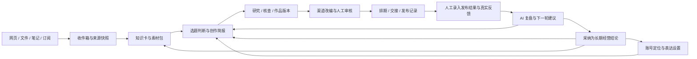

# 内容创作工作台 · 需求与开发文档

版本：v0.6.0 · Multica 二次开发方案  
日期：2026-09-12  
项目目录：`F:\GJ\内容创作工作台`  
已确认定位：**仅中国社交媒体内容创作；品牌内容运营，支持单人使用并预留小团队；人工发布与记录，AI 复盘。**

这是一个帮助创作者长期经营中国社交媒体内容的 Web App：持续收集素材、积累知识、维护 IP 定位与表达风格，解释今天什么值得写，推动作品经过创作、修改、审核和交接；运营者手动发布并录入真实记录，AI 完成复盘并支持下一轮创作。

当前已确认路线为 **以 Multica 为源码底座，复用任务与执行体系，新增内容业务模块，以 Skill 驱动 AI，插件按需使用**。前端沿用 Next.js / React / TypeScript，后端与 daemon 沿用 Go；该决定取代 Easel-For-Hermes 的 FastAPI/Vite 工程映射。供应商无关、空间隔离、人工发布与记录、AI 复盘等产品要求继续有效。Multica 源码已下载至 research/multica，尚未创建实施工程、安装依赖或运行应用；v0.5.0 是已接受的设计方案，不是功能完成声明。

本版进一步明确：彻底移除 OpenClaw 依赖及兼容层，不保留旧路径别名或回退。官方客户端自行管理登录，工作台不提取订阅令牌。决策与本轮文件关联见 [本地 Agent 与 OpenClaw 移除记录](records/2026-09-12-本地Agent接入与OpenClaw移除记录.md)。

核心架构与切换契约见 [07-隔离工作空间与可替换AI执行架构](docs/07-隔离工作空间与可替换AI执行架构.md)。Hermes 是可选执行器；首版允许创建和切换品牌隔离空间，每个品牌内支持多账号及各账号人设提示词、项目和 SOP。

## 当前文件

当前开发入口：[11-首版开发基线与实施清单](docs/11-首版开发基线与实施清单.md)。它汇总 Grilling 最终决定、W-01～W-09 开发顺序、依赖和验收出口；本次仅整理文档，尚未开始应用实施。

2026-09-12 最新专项修订见 [10-审核内核合并与精简计划](docs/10-审核内核合并与精简计划.md)：采用品牌工作空间、多账号及各账号人设提示词、强制人工审核，以及浏览器优先测试。主工作流、PRD、技术与验收已同步至 v0.5.0；既有需求编号保留，新增 D11 验收追踪。此次附件更新与文件用途见 [更新记录](records/2026-09-12-审核合并精简计划更新记录.md)。

研究基准：[research/multica](research/multica)，提交 `3551e72e76d2c276e550b668303646d1280fb1e2`。[08 源码研究](docs/08-Multica源码研究与小改可行性.md)记录证据与缺口；[09 开发决策与模块映射](docs/09-Multica二次开发决策与模块映射.md)是当前实施依据。插件入口默认受关闭的功能开关控制，核心流程必须在插件关闭时仍可用。许可证及认证/隔离差异仍按 08 处理，选定蓝图不代表已取得对外服务或改品牌授权。

新增项目内置依赖：[self-media-compliance-review](vendor/skills/self-media-compliance-review/SKILL.md)，固定提交 `9a1a530a6840280ed5726aa9a5073b2f7dc8a125`；[vendor 接入约定](vendor/README.md)及 [锁文件](vendor/skills.lock.json)记录来源和哈希。源码已收进开发库，应用默认加载/执行和报告门禁仍待开发，不表示 Multica 已有可运行风险检测层。

| 文件 | 主要用途 | 适合谁读 |
|---|---|---|
| [00-GitHub开源对标.md](docs/00-GitHub开源对标.md) | 历史开源研究与产品参考；当前代码基准见 09 | 产品、架构、开发 |
| [2026-09-12-对话记录与文件关联.md](records/2026-09-12-对话记录与文件关联.md) | 本次对话、已确认选择、当前文件状态及关联 | 后续接手者 |
| [01-完整工作流.md](docs/01-完整工作流.md) | 首次建档到日常经营的流程、分工、状态与异常 | 创作者、产品、运营 |
| [02-开发需求PRD.md](docs/02-开发需求PRD.md) | 11 个模块、55 项功能需求、10 项非功能需求与页面范围 | 产品、设计、开发 |
| [03-技术设计与开发路线.md](docs/03-技术设计与开发路线.md) | 技术组合、数据、版本、API/MCP、AI 复盘及 10 个开发工作包 | 开发、架构 |
| [04-验收标准与追踪矩阵.md](docs/04-验收标准与追踪矩阵.md) | 65 项基础验收、D10/D11 补充检查及端到端场景 | 产品、开发、测试 |
| [05-两份补充材料价值评估.md](docs/05-两份补充材料价值评估.md) | 两份附件的增量价值、重复、范围冲突和 GitHub 核验 | 产品、设计、开发 |
| [06-Hermes开发基准与改造映射.md](docs/06-Hermes开发基准与改造映射.md) | 历史 Easel/Hermes 方案，工程映射已被 09 替代 | 历史追溯 |
| [07-隔离工作空间与可替换AI执行架构.md](docs/07-隔离工作空间与可替换AI执行架构.md) | 当前空间隔离、执行器与模型切换契约 | 开发、架构、测试 |
| [09-Multica二次开发决策与模块映射.md](docs/09-Multica二次开发决策与模块映射.md) | D-10 架构决定、复用/新增/Skill/插件边界及工程映射 | 产品、开发、架构 |
| [v0.4.0 历史文档更新记录](records/2026-09-12-v040Multica二次开发文档更新记录.md) | 本次确认、文件关联、修改与验证范围 | 后续接手者 |
| [08-Multica源码研究与小改可行性.md](docs/08-Multica源码研究与小改可行性.md) | 最新 Multica 蓝图研究、源码位置、复用/新增边界、许可证与认证差异 | 产品、开发、架构 |
| [Multica 下载与研究记录](records/2026-09-12-Multica下载研究记录.md) | 本轮要求、下载位置、验证范围及文件用途 | 后续接手者 |
| [v0.2 重新生成记录](records/2026-09-12-v02重新生成记录.md) | 上一版生成时的授权、文件用途与核对结果 | 后续接手者 |
| [补充材料评估与底座确认记录](records/2026-09-12-两份补充材料评估记录.md) | 本轮用户要求、底座选择、文件关联和检查结果 | 后续接手者 |

建议先看 09 的开发决定，再按工作流 → PRD → 技术方案 → 验收文档阅读。当前范围以 v0.5.0 和用户最新指令为准；00、05、06 与早期 records 中的底座选择保留为历史。现有 55 项功能需求和 10 项非功能需求 ID 保持稳定，新增 D-10 决策及其验收检查，不以换底座缩减产品范围。

### 实现方式

| 方式 | 责任 |
|---|---|
| 复用 Multica | 工作区、成员权限、项目、Issue/Task、运行记录、本机 daemon 与已有 Agent 后端；复用后仍需验收 |
| 新增内容业务模块 | 账号表达配置、素材知识库、选题、作品编辑与版本、审核交接、人工发布和指标记录、复盘与经营记忆 |
| Skill | 指导 AI 研究、核查、创作和复盘；输入输出受服务端契约约束，不掌握审批和真实记录写权限 |
| 可选插件 | 素材侧栏、IP 摘要、审核辅助面板；关闭或卸载后不影响正式作品和经营闭环 |

## 产品的三个闭环

## 能力地图

本表是当前评审稿的模块索引，模块 ID 稳定不随页面名称变化。“依赖”表示实现依赖；复盘对选题的反馈通过公共数据契约提供，不形成模块代码的循环引用。

| 模块 ID | 责任 | 依赖 | 需求范围 |
|---|---|---|---|
| `workspace-core` | 身份、工作区、文件、审计、运行记录与公共反馈数据契约 | — | R-001～R-004 |
| `ip-profile` | IP 定位、内容支柱、风格、经营节奏及其版本 | workspace-core | R-005～R-008 |
| `source-inbox` | 输入、订阅、解析、来源快照与去重 | workspace-core | R-009～R-014 |
| `knowledge-base` | 知识卡、来源依据、检索和素材包 | source-inbox | R-015～R-019 |
| `topic-planning` | 候选选题、解释、决策、创作简报与日计划 | ip-profile、knowledge-base、workspace-core | R-020～R-024 |
| `agent-workflow` | 上下文包、研究、对标、事实核查和受控任务执行 | topic-planning、work-editor | R-025～R-030 |
| `work-editor` | 正式作品、编辑、AI 修改建议、版本与渠道制作包 | workspace-core | R-031～R-037 |
| `review-delivery` | 审核、排期、渠道交接、发布事实记录 | work-editor | R-038～R-043 |
| `feedback-learning` | 人工指标/反馈、AI 复盘、经营结论与再利用 | review-delivery、workspace-core | R-044～R-048 |
| `project-collab` | 内容项目、任务与日历；后续增加成员协作 | work-editor、review-delivery | R-049～R-051 |
| `agent-gateway` | 服务 API、Skill/桥接、MCP 接入与权限 | agent-workflow、work-editor、review-delivery | R-052～R-055 |

构建顺序：公共对象与版本约束 → 一条人工可完成的作品闭环 → Agent 增强与接口接入 → 反馈驱动的选题 → 小团队与更多连接器。

## 首版范围摘要

- 品牌隔离工作区创建与切换，空间内支持多账号及各账号人设提示词；维护内容支柱、风格样本和中国社交媒体发布节奏。
- 原生速记、网页链接、文件、转录文本和 RSS/Atom 订阅入库；第三方工具优先通过用户导出文件接入。
- 可追溯的知识卡、素材包、每日建议选题和人工选题决策。
- Agent 研究与正文创作、持久化可编辑作品、AI 修改建议和不可变版本。
- 公众号文章、小红书图文、抖音短视频、视频号短视频四类初始模板；导出内容和制作说明，媒体成片生成属于后续扩展。
- 人工审核、排期提醒、已审核版本导出、人工发布记录。
- 人工录入发布指标和反馈；AI 生成作品/每周复盘与下一轮建议，可编辑并采纳为长期经营结论。
- 服务 API、外部 Agent 提交作品的契约和首个 Skill/本地 MCP 桥接；远程 MCP 与具体客户端兼容性逐项验证。

## 设计取舍

1. **作品是长期资产。** 聊天用于下达意图和解释结果；作品、证据、版本和审核记录有独立页面与 ID。
2. **选题必须解释理由。** 结合受众问题、素材证据、IP 方向、时效与投入；没有历史数据时明确标注冷启动。
3. **采用、审核、发布各有含义。** 个人可以完成所有动作，但系统保留动作与版本关系。
4. **审核后生成待发布包，运营者手动发布。** 工作台提供排期提醒、发布登记与复盘；平台直连发布不在产品范围内。
5. **记录由人填写，复盘由 AI 完成。** 缺失数据保持缺失；AI 分析有独立成果与依据，用户可采纳结论。
6. **只服务中国社交媒体。** 本稿首版以公众号、小红书、抖音、视频号四个平台建模；知乎、B站、快手、微博等按后续需求扩展。具体首发组合为设计建议，中国平台范围已由用户确认。
7. **保留原来的资料工具。** 引入来源及上下文，不要求迁移整个笔记库。

“DraPub”在用户描述中按能力参考处理，本稿使用“内容创作工作台”作为工作名称；未假设已接入该服务。

## v0.5 同步与上游准备

两份审核上游均已有本地源码与固定提交，见 [来源锁定清单](research/upstreams.lock.json) 和 [本轮交付记录](records/2026-09-12-v05全套文档与上游准备记录.md)。A 是 vendor 源码快照，B 是 research Git checkout，下载不代表自动启用或完成代码合并。
