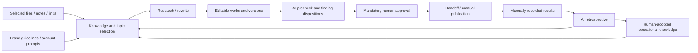

# Loretide

UI development policy: [reuse Multica components, layouts, typography and design tokens](docs/design/README.md). This applies to all new pages, including development diagnostics.

**English** | [简体中文](README.zh-CN.md)

> Turn knowledge into a publishing tide.

**A local-first content workspace for brand operations.**

Repository: [899ms/loretide](https://github.com/899ms/loretide)

Loretide connects source materials, account-specific writing instructions, research and rewriting, editable works, human review, manual publication records, and AI retrospectives. It is designed to validate a repeatable content operating workflow for Chinese social media.

**Status: a Multica-derived application and diagnostics implementation exist in a separate local checkout. Migration to native Windows development is in progress; local acceptance is not complete.** This GitHub repository contains specifications, tasks and records; application source is not yet published here.

Documentation baseline: v0.6.0 · Updated: 2026-09-13

## Start here

**Development tasks:** [Implementation plan](tasks/plan.md) · [Task checklist](tasks/todo.md). W-01–W-03 are split into 24 tasks, plus [2 architecture prerequisites](tasks/architecture.md), followed by 6 phase-level items and 9 checkpoints. There are also [13 mandatory early diagnostics tasks](tasks/diagnostics.md) and a diagnostics gate before LT-009. The application checkout and native test environment are established. Loretide business features remain pending; see the task ledger and records for verified checks and remaining gaps.

The detailed development documents are currently in Chinese.

1. [Development baseline and implementation checklist](docs/11-首版开发基线与实施清单.md): confirmed decisions, W-01 through W-09, dependencies, and acceptance criteria.
2. [Complete workflow](docs/01-完整工作流.md): account setup through publication records and retrospectives.
3. [Product requirements](docs/02-开发需求PRD.md): 55 functional requirements, 10 nonfunctional requirements, and page scope.
4. [Technical design](docs/03-技术设计与开发路线.md): data, permissions, versioning, execution interfaces, and work packages.
5. [Acceptance matrix](docs/04-验收标准与追踪矩阵.md): 65 baseline checks, 6 D10 checks, and 11 D11 checks.

Document 11 summarizes the latest confirmed decisions. Superseded proposals remain in historical records for traceability, not as implementation requirements. Design decisions, simulated checks, and real application tests are reported separately.

## What Loretide is for

Bookmarks, notes, product specifications, customer feedback, and finished assets often live in separate tools. Loretide organizes them around accounts and works, helping operators decide what to create, assemble supporting material, research comparable content, and create or rewrite formal, editable outputs.

Operators publish manually and enter actual results. AI analyzes those records and proposes next steps; durable operational knowledge is updated only after human adoption.

## Confirmed first-release behavior

| Area | Decision |
|---|---|
| Brands and accounts | One workspace per brand, with multiple accounts, projects, and configurable SOPs. Start with individual operation and leave room for small teams. |
| Persona prompts | Each account has its own `persona_prompt`, used automatically for its work. No separate persona library, cross-account persona binding, or per-task persona selection. |
| Authorization | Brand materials can be reused within authorized scope. Account-specific materials and knowledge require task authorization; prompts do not grant access. |
| Local files | Operators organize folders and retain file versions. Register explicitly selected files only: no folder scanning or watching, automatic reorganization, automatic finished-media snapshots, or mandatory cloud upload. |
| Material selection | AI searches registered, authorized materials automatically. Operators can require or exclude materials and inspect actual references. |
| Research and rewriting | Both support Local, Web, and All (Local + Web). Local limits information retrieval; it does not require an offline model. |
| Start screen | Set the topic, material requirements, and source scope together, without an extra confirmation dialog. Remember scope per account, initially All, and freeze it when execution starts. |
| Network failure | In All mode, preserve available results and pause dependent creation. The operator chooses retry or continuation with existing material. Temporary recovery does not change account preferences. |
| SOPs | Constrained step templates with dependency validation, confirmation, return, retry, and recovery. Preserve human confirmation of research conclusions before drafting. |
| Precheck | Enabled by default at brand level, shared by all accounts. Run on review submission, not on every draft save. Manual checks remain available when automatic checks are off. |
| Approval | Preserve original AI reports separately from individual human dispositions. Incomplete checks cannot be labeled AI-passed. Final human approval is mandatory and tied to the exact delivery version. |
| Media | Create copy and scripts in the workspace. Produce images and finished videos externally, register local references, and review them manually. Script review is not finished-media review. |
| Learning | Publish and record actual results manually; use AI for retrospectives. Missing data stays missing. Durable operational knowledge requires human adoption. |

Missing or changed local files affect delivery validation. If operators do not retain an older media file, Loretide can retain its review record but cannot restore the file. Opinions, experiences, and creative content are not universally required to have external factual citations.

The product targets Chinese platforms. WeChat Official Accounts, Xiaohongshu, Douyin, and WeChat Channels are suggested initial templates. Direct platform publishing, automatic editing or media generation, arbitrary DAG canvases, and independent persona management are outside the first release.

## Architecture and testing

Use **Multica** as the source-code foundation: Next.js / React / TypeScript for the web workspace, Go for the API and local daemon, and PostgreSQL. Core content features use native pages and services. Skills guide AI work; the backend enforces authorization, state, and human approval. Plugins are optional helpers.

The execution architecture is replaceable, targeting Pi, OpenCode, Codex, Claude Code, Hermes, Gemini, and API paths. Each path requires separate validation; this is not a claim that they are already connected. OpenClaw is excluded from the delivered dependency chain.

The first real integration path uses local Codex. Prefer its search and page-reading capabilities once verified in that execution environment; do not initially add paid search or social-media collection services. Tools available in a chat session do not prove daemon integration works.

**The browser is the primary daily testing entry point.** A desktop window is not required alongside it. Start with an isolated local development instance for debugging, then validate pairing, disconnection, and recovery between remote services and the local daemon. Verify actual topology, ports, client capabilities, and isolation during implementation.

## Delivery status

| Item | Status |
|---|---|
| Workflow, PRD, technical design, acceptance, and decision summary | Documented at baseline v0.6.0 |
| Work packages | W-01–W-03 split into 24 tasks; W-04–W-09 retained as 6 phase items; all pending |
| Git / GitHub | Private documentation repository on `main` |
| Multica and both review upstreams | Pinned local sources; provenance and hashes recorded; review Skill A snapshot included under vendor |
| Application implementation and database | Not created |
| Merged review capability, default Skill loading, and Go approval enforcement | Not implemented |
| Browser application, real Agent, and remote recovery acceptance | Not run |

There is no application startup command in this repository yet. Installing vendor dependencies does not produce the complete workspace. The next executable task is LT-001: establish the isolated application checkout and Git boundary. Near-term tasks now include dependencies, deliverables, and acceptance criteria.

## Documentation and upstreams

| Link | Purpose |
|---|---|
| [07 Isolation and replaceable AI](docs/07-隔离工作空间与可替换AI执行架构.md) | Brand/account boundaries, execution and credential isolation |
| [08 Multica source research](docs/08-Multica源码研究与小改可行性.md) | Capabilities, licensing, and gaps at the pinned commit |
| [09 Module mapping](docs/09-Multica二次开发决策与模块映射.md) | Reuse, native additions, Skills, and plugins |
| [10 Review kernel plan](docs/10-审核内核合并与精简计划.md) | Combining review capabilities, contracts, and evaluation |
| [Grilling record](records/2026-09-12-Grilling需求追问记录.md) | Decision history and corrections |
| [v0.6 consolidation record](records/2026-09-12-v06开发基线收口记录.md) | File relationships, cleanup, and validation |
| [Git initialization record](records/2026-09-13-Git初始化与GitHub同步记录.md) | Repository boundaries and synchronization evidence |
| [Upstream manifest](research/upstreams.lock.json) / [Skill lock](vendor/skills.lock.json) | Commits, paths, and file hashes |
| [Vendor integration notes](vendor/README.md) | Source preservation, runtime loading, and authorization |

Pinned research sources:

- [Multica](https://github.com/multica-ai/multica/tree/3551e72e76d2c276e550b668303646d1280fb1e2): a local research checkout, excluded from this repository.
- [self-media-compliance-review](vendor/skills/self-media-compliance-review/SKILL.md): commit `9a1a530a6840280ed5726aa9a5073b2f7dc8a125`; 55 original files included under vendor with their license.
- [yuwen-publish-precheck](https://github.com/yuwen-cool/yuwen-publish-precheck/tree/44a7b654283726db153591df73cbafe255685f33): 33 files in a separate pinned local checkout; hashes recorded in the upstream manifest.

Some research documents contain local paths and source-line links intended for the original workspace. On GitHub, use the pinned upstream commits above. Documents 00, 05, and 06 retain historical research; Multica supersedes the earlier Easel/Hermes implementation mapping.

## Repository conventions

This repository tracks development documents, project records, provenance, and vendor dependencies. Research checkouts and the future application remain separate. Materials, finished media, databases, credentials, caches, pre-edit folder backups, and one-off editing scripts are excluded; see [.gitignore](.gitignore).

Read [AGENTS.md](AGENTS.md) before contributing or taking over. Record each change and its related files, preserve requirement and acceptance IDs, and support completion claims with actual evidence. Preserve vendor bytes; upgrades must use explicit pinned commits and renewed verification.

No open-source license has been declared for this project's own content. Upstream licenses are handled separately. Private storage does not grant public-hosting, rebranding, or redistribution rights.

## Modular boundaries

The planned implementation is a modular monolith with explicit data ownership and public interfaces. See [module boundaries and regression rules](docs/12-模块边界与变更回归约束.md). Dependency checks, consumer contract tests, and critical workflow regression are required; these protections are not implemented yet.

## Full diagnostics from the start

[Diagnostics specification](docs/13-完整开发诊断与操作日志需求.md) covers operation audit logs, technical errors/logs, cross-layer traces, a browser diagnostics panel, input snapshots, reproducible simulated failures, and regression results. All capabilities are required early, not a reduced version. Subsequent features must ship their instrumentation and tests together. This is planned work, not an implemented monitoring system.

## AI development workflow

Read [CONTRIBUTING.md](CONTRIBUTING.md). Claim an unassigned ready [Issue](https://github.com/899ms/loretide/issues), confirm unique ownership, work in an isolated branch/worktree with a separate test database and ports, then deliver a Draft PR. The main task reviews and merges; executors do not close Issues themselves. Code tasks cannot become ready until their application repository and baseline commit are available. GitHub does not automatically start AI workers.
