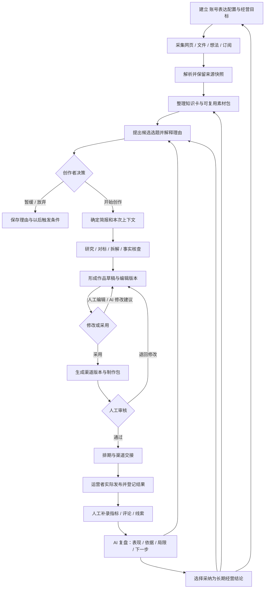

# Loretide · 完整工作流

版本：v0.6.0 · Multica 二次开发方案（中国社交媒体范围）  
日期：2026-09-12  
关联：[PRD](02-开发需求PRD.md) · [技术设计](03-技术设计与开发路线.md) · [验收](04-验收标准与追踪矩阵.md)

用户先进入品牌隔离空间，再选择项目、目标账号与 SOP。品牌公共资料可授权给各账号使用；账号专属资料和经营记忆按任务授权读取。各账号分别设置人设提示词与平台配置，任务直接沿用该账号配置。每次运行前可选执行器与模型，后续阶段可携带已保存的产物切换；不会直接迁移不同框架的内部会话。详见 [通用执行与隔离架构](07-隔离工作空间与可替换AI执行架构.md)。

## 1. 经营目标与工作原则

系统围绕中国社交媒体创作者的长期问题组织工作：**我服务谁、持续表达什么、今天该推进哪一项内容，以及发布之后学到了什么。**

用户已确认仅面向中国社交媒体，以个人创作者为主，预留小团队协作；发布和发布后的结果/反馈记录由人完成，复盘由 AI 基于这些记录处理。个人可以同时承担创作者、审核者和运营者；界面减少重复填写，底层仍记录各次决策。

开发底座确定为 Multica：复用空间、任务和本机执行体系，新增内容业务模块，Skill 指导 AI 工作，插件作为可选辅助扩展。Pi、OpenCode、Codex、Claude Code、Gemini、Hermes 和模型 API 是目标执行路径，具体可用性和隔离能力逐项验证；Gemini CLI 与完整 API 任务执行器仍需新增。客户端登录与 API 连接分别管理。OpenClaw 依赖、兼容层、安装与执行分支全部移除；不增加平台自动发布或自动经营数据采集。详见 [开发决策与映射](09-Multica二次开发决策与模块映射.md)。

流程不要求安装平台插件。用户在原生内容页面选择简报和授权素材，业务服务关联 Multica 任务；daemon 调用选定执行器，Skill 提供步骤和交付格式。结果先回到运行记录，再经业务服务校验为候选作品版本，在编辑器中采用或修改；任务完成或聊天返回正文都不代表作品已审核。人工发布、真实数据登记和 AI 复盘由独立业务对象衔接。关闭插件时整条流程仍须成立。

日常使用从“今日工作台”开始。那里应同时呈现值得写的选题、正在推进的作品、需要处理的审核、到期交接和待补录的反馈。纯浏览、积累素材、暂缓创作都是有效结果。

流程有四类产物：

| 类别 | 产物 | 价值 |
|---|---|---|
| 原始输入 | 来源记录、不可变快照、附件、转录文本、订阅条目 | 找回原始上下文 |
| 可复用知识 | 知识卡、证据引用、观点、案例、素材包 | 支撑重复使用与核查 |
| 创作与交付 | 选题简报、研究报告、作品版本、渠道稿件、制作包、审核、交接单 | 让工作连续推进 |
| 经营记忆 | 发布记录、人工指标、反馈摘录、AI 复盘、已采纳结论、档案新版本 | 让下一次判断更有依据 |

## 2. 端到端流程

## 3. 首次使用：建立经营底座

### 3.1 建立 账号表达配置

创作者输入受众、常见问题、经验与可信依据、定位主张、内容支柱、表达风格、禁用表达、主要渠道、每周可投入时间及内容目标。可以上传自己已发表且认可的作品作为风格样本。

Agent 可从输入中提炼候选档案，逐项展示提炼依据。创作者确认后形成 `AccountConfigRevision`。未确认项保留为“待补充”，不自动猜测身份、经历、成绩或商业承诺。

最小可开始条件：受众、内容方向、至少一个渠道、可投入时间。缺少风格样本时使用中性表达并标记；不阻止记录素材或人工写作。

### 3.2 设定运营规则

设定每周内容节奏、渠道模板、审核规则、默认时区、反馈观察时点。排期用于提醒运营者手动处理，不触发平台发布。默认时区由工作区显式设置；本稿示例使用 `Asia/Shanghai`。

个人默认自己审核。后续团队模式可要求不同成员复核。渠道设置保存账号名称或主页链接以便标识，系统不需要平台登录凭据，模型上下文仅接收必要的渠道说明。

### 3.3 导入少量历史资产

优先导入已认可作品、常用参考资料、典型用户问题及可用的真实历史反馈。系统保留它们的“历史导入”标识。历史内容不知道采用了哪个原稿版本时，创建“发布后快照”，不虚构版本链。

没有历史数据也可开始。推荐依据来自 IP 方向与现有素材，并明确显示“暂无个人表现数据”。

## 4. 输入到知识：把素材收成可复用资产

| 步骤 | 人的动作 | 系统与 Agent 的动作 | 持久化产物 / 进入下一步条件 |
|---|---|---|---|
| 1. 快速采集 | 粘贴链接、速记、上传文件或选择导出资料 | 记录输入类型、采集时间、标签、个人批注 | `Source` 创建成功；解析可继续后台进行 |
| 2. 订阅更新 | 添加和停用订阅、设定主题过滤 | 获取已配置 RSS/Atom，按源内 ID 和链接去重 | `FeedItem` + `Source`；显示最近成功时间 |
| 3. 内容解析 | 必要时补标题、正文或上传可读文本 | 抽取正文/页码/时间码，保留原件与哈希 | `SourceSnapshot`；状态 ready / partial / failed |
| 4. 归类与判断 | 采纳分类，说明为何收藏 | 建议摘要、实体、观点、问题与关联资料 | 原文、自动摘要和个人判断分开保存 |
| 5. 知识沉淀 | 选中片段，确认事实或观点类型 | 生成知识卡候选并附来源位置 | `KnowledgeCardRevision`；确认后用于正式知识检索 |
| 6. 组成素材包 | 围绕一个问题收集多个来源 | 展示支持、冲突、时效、缺口及可用性 | `MaterialPackRevision`，冻结本次来源版本 |

知识卡至少区分事实、引文、案例、方法、个人观点、待验证假设。收藏次数、订阅出现次数、来源知名度都不直接等于事实可靠性。

输入保存成功后即可离开页面；解析失败不丢失原始条目。重复素材先提示合并关联，保留各次采集批注。网页更新生成新快照，历史作品继续引用旧快照。

**外部工具接入顺序：** 首版支持粘贴文本、公开网页及导出文件，覆盖收藏、幕布大纲、飞书文档、Obsidian 笔记和转录稿的可读输入路径。专用双向同步、登录网页读取、复杂页面抓取、自动音视频转录及扫描件 OCR 作为后续连接器逐项验收。

## 5. 知识到选题：回答今天什么值得写

### 5.1 每日建议的输入

候选选题综合当前 账号表达配置、知识卡与素材包、近期订阅信号、已有选题与作品、可用时间、内容支柱覆盖、已确认经营结论和运营者已记录的历史反馈。

每日建议默认最多展示 5 个优先候选，可展开备选。排序不能把“今天发布最多”作为唯一目标；还应覆盖常青问题、已有作品更新、系列续篇和资料尚不足的储备选题。

### 5.2 一张选题卡必须说清楚

- 写给谁，解决什么具体问题，拟表达什么判断。
- 为什么适合这个 IP，引用哪些素材和过去的经营结论。
- 为什么是现在：时效窗口、内容计划或常青价值；没有时效依据就直接说明。
- 与已有作品的关系，是新角度、更新还是高度重复。
- 证据是否充分，存在什么缺口，需要多少研究或制作投入。
- 适合哪些渠道，有什么表现参考及不可比较因素。
- 推荐动作：今天推进、补证后推进、加入储备、更新旧作、暂缓。

用户可以开始、收藏、暂缓、放弃或提出自定义选题。暂缓和放弃支持快捷原因及自由备注；这些是偏好信号，单次操作不永久改变 IP 定位。

### 5.3 冻结创作简报

选择开始后创建 `ContentBriefRevision`，明确受众、核心问题、主张与边界、渠道、形式、结构、引用要求、资料范围、交付物、时间和成本上限。

简报可以包含多个渠道。正文的核心论证可复用，各渠道开头、长度、结构和行动引导分别生成。用户修改简报时生成新版本，已有运行继续引用它开始时的版本。

## 6. 选题到作品：Agent 工作流

| 阶段 | 输入 | Agent 交付物 | 人的控制点 |
|---|---|---|---|
| 资料整理 | 简报、素材包、知识卡 | 资料目录、摘要、缺口清单 | 可增删本次可用材料 |
| 对标研究 | 用户指定或搜索发现的公开参考 | 对标矩阵：受众、角度、结构、证据、呈现方式、差异机会 | 对标用于研究方法与角度，不自动复制表述 |
| 选题拆解 | 研究结果、受众问题、主张 | 论点结构、提纲、反方观点、待核查论断 | 重要方向变化需要用户选择 |
| 事实核查 | 论断与来源快照 | `ClaimCheck`：支持、冲突、证据不足、过时或待人工核查 | 人可补证、改写、删去或说明处置 |
| 正文创作 | 已知证据与明确边界 | 可编辑草稿、引用映射、未解决问题、创作说明 | 即刻进入作品库，状态为草稿 |
| 渠道改编 | 已采用正文或渠道简报 | 独立渠道稿件、标题备选、格式与制作说明 | 逐渠道选择版本 |

研究、对标、核查和正文都是可打开的文档类成果，挂在同一作品下。运行页显示阶段、用到的来源、成本与错误；聊天消息链接到这些成果。

生成内容自动持久化为正式管理的**草稿资产**，无需复制粘贴出聊天框；“正式管理”不等于创作者采用或审核通过。

### 6.1 事实核查规则

核查对象包括数字、日期、价格、性能、因果、引文、比较结论和案例成效。每条结论保存相关来源位置、核查时间与适用范围。个人观点需要标明观点属性。

有来源不代表已证实。来源只讲行业趋势时，不能作为某个产品效果或真实案例的直接证据。Agent 无法核实时输出缺口，不补造数据和引用。

草稿可含待核查标记。事实问题与 AI 原始风险报告永久保留；人工可逐项补证、修改、说明误报或说明接受风险，再对确定版本完成最终审批。接受风险不将未证实论断改成已证实事实。经验、观点、假设和创意不统一要求外部事实引用。

### 6.2 运行中断与恢复

没有模型或研究工具时仍可人工写作、编辑、审核和记录反馈；AI 复盘显示待运行并可恢复。联网研究不可用时，Agent 限定在已有素材内工作，并显示研究范围。

超时、取消或失败保留已经完成的产物。重试从失败阶段或新的运行开始，显示关系及新增成本；执行状态不确定时先查询状态，避免重复产生文档或交接任务。

## 7. 作品编辑、AI 修改和版本采用

作品容器 `Work` 下可以有正文、研究报告、小红书稿、公众号稿、视频脚本、拍摄清单等多个 `Artifact`。每个文档有自己的编辑副本与版本历史。

编辑器支持人工修改、自动保存、选段 AI 改写、全文润色、结构调整、来源侧栏、版本差异和恢复历史版本。

AI 修改从指定版本出发，输出候选版本与改动说明。用户可以全部采用、分段采用或放弃。分段采用生成新的组合版本并保留来源关系；不直接覆盖正在编辑的副本。

采用当前版本表示“此版是下一步工作基线”。提交审核会冻结具体渠道版本。恢复旧版本会产生一个新版本；已审核、已交接、已发布版本始终保留。

### 7.1 各对象的状态

| 对象 | 状态 | 规则 |
|---|---|---|
| 素材解析 | pending → processing → ready / partial / failed | 解析状态与知识是否确认分开 |
| 选题 | proposed → shortlisted → briefed → in_progress → completed；可 deferred / dropped | 完成指作品任务完成，发布结果独立记录 |
| Agent 运行 | queued → running → waiting_user / succeeded / failed / cancelled | 恢复和重试有父运行引用 |
| 文档编辑 | working / saved；版本有 generated / edited / adopted 来源与动作记录 | 不用一个“完成”覆盖所有行为 |
| 审核请求 | pending → changes_requested / approved / rejected / cancelled | 审核绑定不可变版本和交付快照 |
| 交付任务 | draft → ready → scheduled / handed_off；可 cancelled / held | scheduled 为人工待办的计划时间；handed_off 表示已导出或交给运营者 |
| 发布记录 | reported_published / verified_published / failed / removed / unknown | 每条带声明者、证据和核验方式 |
| AI 复盘 | pending_data / queued → generating → generated / failed；可 edited / superseded | 报告直接可用；其中的结论可单独采纳、撤回 |

`reported_published` 是运营者声明已发布，必须有时间、渠道和证据或缺证原因；`verified_published` 表示人已核对实际页面、截图或手工上传的回执并记录核验方法。二者都不由模型猜测得出。

## 8. 渠道制作包与审核

| 渠道形态 | 交付内容 | 首版边界 |
|---|---|---|
| 小红书图文/视频 | 标题、正文、话题、逐图文案或口播、封面与配图需求、来源附录 | 文案与制作说明；字段约束来自经核对的平台模板 |
| 微信公众号文章 | 标题、摘要、正文结构、封面与配图位置、引用及排版清单 | Markdown/安全 HTML 预览与导出，运营者自行到平台排版和发布 |
| 抖音短视频 | 标题、口播稿、分镜、字幕、画面建议、拍摄清单、封面文案、话题 | 可编辑脚本与制作包；成片生成/剪辑属后续媒体能力 |
| 视频号短视频 | 标题、描述、口播稿、分镜、字幕、画面建议、拍摄清单、封面文案 | 单独的渠道稿和人工交接包；运营者到平台上传发布 |

四个平台是本稿首版默认组合，属于设计建议。抖音与视频号即使使用同一基础脚本，也分别保存版本、审核与结果。后续可按需增加知乎、B站、快手、微博、今日头条等中国平台。正文默认简体中文，外文来源保留原文与译文关系。

审核页面把交付预览、来源依据、事实问题、AI 改动说明、渠道要求与历史版本放在一起。个人模式可用“确认并提交审核”或“审核通过并安排交接”的连续操作减少跳转，后台仍分别保存记录。

通过审核的对象是**具体渠道、具体文档版本及附件、具体交付配置的快照**。AI 的自检报告作为审核参考，不能执行人工通过动作。

内容、附件或目标账号发生变化时，现有审核记录仍属于原快照。新的交付组合需要重新审核；系统不得把“已通过”自动套在新版本上。

## 9. 排期、渠道交接与实际发布

### 9.1 首版人工交接

审核通过后生成 `DeliveryPackage`，含冻结的渠道正文、媒体文件或缺失说明、制作说明、来源附录、目标渠道、交接者及版本清单。用户设定时间后，日历记录本次交接安排。

到期后产生站内待办；用户导出或复制稿件并到平台发布。导出成功、复制完成或交接给他人都不自动等于发布成功。

运营者登记实际发布时间、平台账号、页面链接或内容 ID、截图/回执、是否在平台上修改。若平台编辑了正文，保留发布后快照或差异说明；无法拿到完整正文时将版本匹配标为 unknown。

### 9.2 手动发布的工作交接

工作台提供逐渠道待发布包、复制/下载动作、计划时间和发布登记入口。渠道适配指内容格式与文件导出，不包括向平台创建草稿、写入排期或直接发布。

运营者在平台完成发布后返回登记结果。忘记登记时工作台继续显示“待登记”，不推断平台状态。运营者可标记实际发布失败、延后或取消，并注明原因。系统不保存平台发布密钥，也不提供发布执行接口。

### 9.3 排期后修改

创建新的候选草稿不会改动已冻结排期。用户把新稿选为交付目标，或更改附件、账号及实质性渠道配置时，相关待执行任务进入 held，直到新快照审核完成。

用户也可明确选择继续交付旧的已审核快照，界面展示版本号和预览。已经实际发布的内容保留原记录；运营者在平台手动纠错、更新或撤回后再登记后续动作，不改写历史。

## 10. 人工反馈到下一轮创作

### 10.1 记录真实结果

首版采用表单与 CSV 导入。每条观测关联发布记录，保存平台、账号、指标名、数值、单位、统计窗口、采样时间、录入人、证据附件和数据来源类型。

曝光、阅读、播放、完播、点赞、评论、收藏、分享、关注、私信和转化按平台可获得情况填写。未知填空；0 只表示已确认的零值。不同平台的“阅读”和“播放”分别保留，不直接合并排名。

评论、私信和线索支持脱敏摘录、分类、自己的解释。数据以运营者手工记录和文件导入进入系统，工作台帮助校验口径、整理和分析。

### 10.2 AI 完成复盘

运营者填写记录后可直接选择“保存并让 AI 复盘”；也可对指定作品/时间段点击生成，或在产品内启用周复盘规则。用户无需先写一份分析。

AI 读取此次固定版本的发布记录、指标、反馈、实际发布稿、原简报目标和可比较历史，生成正式复盘文档：目标与实际差异、主要表现、证据、可能原因、其他解释、数据局限、可执行改进、下一轮选题建议。

对比时提示渠道、内容形式、发布时间、观察时长、投放等差异。缺记录时指出缺口；缺少数据时不能填造指标或编造表现结论。AI 可以提出假设，但不能把相关性写成因果，少量样本不形成稳定规律。

AI 复盘保存为可查看、编辑、导出和追踪版本的报告。新增或更正人工记录会提示报告过期，用户或已启用规则可触发新版；旧报告保留当时的输入。模型失败只影响分析，已录入真实记录仍然保留。

### 10.3 沉淀经营结论

AI 从复盘生成候选 `Learning`，包含结论类型、适用人群与渠道、支持观测、样本范围、例外、下次复查时间。报告与下一轮建议生成后即能查看和使用；用户选择采纳的结论进入长期经营记忆。涉及 IP 或风格修改时，展示差异供用户采用。

影响下一轮的路径：

1. AI 识别的问题与素材缺口 → 带证据和不确定性标记的待研究选题。
2. 已确认的受众需求 → 选题理由和内容支柱建议。
3. 表达实验观察 → 风格修改建议；创作者确认后形成新的 账号表达配置版本。
4. 事实补充与纠错 → 知识卡新版本，并提示相关作品复查。
5. 未采纳的分析作为临时建议呈现；结论被撤回或过期 → 后续推荐停止将其作为稳定依据，历史推荐仍保留当时上下文。

## 11. 日常经营节奏

| 节奏 | 用户主要工作 | 工作台应呈现 |
|---|---|---|
| 随时 | 收集想法、链接、文件、观察 | 快速入口与待整理收件箱 |
| 每天开始 | 看选题建议，选定今天推进的一项工作 | 选题理由、预计投入、审核与交接到期项 |
| 创作时 | 调整简报、研究、编辑、采用、审核 | 一件作品的连续工作区 |
| 发布后 | 登记发布结果，到期补录观测 | 版本核对、指标表单、缺失字段提示 |
| 每周 | 查看 AI 复盘，采纳有用经验、调整计划 | AI 生成的经营目标进度、资料复用、表现、限制及下一步 |
| 每月 | 检查 IP 方向和系列内容结构 | 内容支柱覆盖、长期资料缺口、待更新作品 |

提醒只服务可执行动作，可设置频率、暂停和静默时段；相同未变化待办不反复制造通知。

## 12. 贯穿全程的例子

以下为流程演示，选题与数据均为虚构测试内容，不可计入真实经营数据。

创作者希望面向自由职业者分享工作方法，保存了三篇参考文章、一段访谈转录及自己的试用笔记。系统形成“多项目切换成本”的素材包，指出访谈是个体经验、统计结论尚缺原始研究。

今日候选提出“每周复盘为何总做不下去”，理由来自受众问题、现有材料及近期内容计划。创作者选择“给出可执行的十分钟流程”，确定公众号文章与抖音短视频脚本两个交付物。

Agent 先生成资料与对标报告，标出无依据的效果百分比。创作者删去该论断，采纳正文 v3。公众号渠道稿 a2 经审核后安排交接；短视频脚本 s1 继续修改，不影响公众号稿。

运营者手动发布公众号文章，记录真实链接、时间，并说明在平台修改了一处标题。次日和一周后分别录入该平台实际可见指标；系统按不同观测窗口保存。AI 读取这些人工记录生成复盘，提出“具体流程比抽象感悟更适合这一系列”作为待测试判断。下一轮推荐展示该建议、依据与样本限制；创作者采纳后再成为长期经营结论。

## 13. 常见异常与回退

| 情况 | 应有行为 |
|---|---|
| 链接失效、登录限制、解析不完整 | 留下来源与错误，允许粘贴正文、上传导出文件或重试 |
| 来源互相冲突或过期 | 知识与作品标出冲突，关键事实进入待核查 |
| 没有足够素材或反馈 | 明示冷启动与缺口，允许人工输入或补充研究 |
| AI 结果不符合风格 | 保留原版，修改简报或风格规则后生成候选版 |
| 编辑期间另一个任务生成新稿 | 新稿进入候选区，现有编辑内容不被覆盖 |
| 用户关闭浏览器或 Agent 断线 | 后台运行可查询，已保存内容可恢复 |
| 审核后素材被撤回 | 提示受影响作品，待执行交付进入复核处理 |
| 某个渠道发布失败 | 运营者分别登记结果，成功渠道保持完成，失败渠道留待人工处理 |
| 反馈有误或重复录入 | 新更正记录替代旧记录；原始观测和审计保留 |
| 订阅或适配器停用 | 停止新任务，保存既有资料与历史结果 |

## v0.5 开发基线与追踪

本轮已将品牌空间、账号授权、账号提示词、受约束 SOP、风险处置和浏览器测试决定同步到主工作流、PRD、技术与验收。仍为开发规格，不表示应用已实现。审核细节以 [审核内核计划](10-审核内核合并与精简计划.md) 为专项契约；相同输入快照在所有入口使用相同后端规则。

已确认新建品牌空间的自动预检默认开启，提审时触发，关闭后保留手动检查。首版所有账号统一使用品牌级开关，不提供账号级覆盖；最终人工审核不可关闭。首版媒体边界已确认：文字、图文文案和视频脚本在工作台内创作；图片与视频成片在外部制作后放入已授权的本地工作/素材文件夹，由工作台登记引用，作为正式作品附件支持预览、版本绑定及人工终审，替换附件后重新审核。首版不要求内置排版、剪辑、媒体生成或成片自动审核；AI 必须区分文字已检查与媒体未检查，不能以脚本检查代替成片审核。

### 品牌运营 SOP 的完整执行路径

1. 创建品牌空间，建品牌公共资料、账号、人设提示词及平台配置；分别设置资料归属和任务授权。
2. 收集网页、文件、笔记与转录；保留原文和来源，选择公共或账号专属范围；AI 整理仅生成候选资产。
3. 选择账号（沿用其人设提示词）、项目、SOP 版本和授权素材包；生成选题及理由，由人决定推进。
4. 执行研究、对标与按内容性质进行的核查；保留正文创作前一次研究结果确认。
5. 生成正式作品与各账号渠道版本；人工编辑或采纳 AI 修改，产生新版本，不覆盖历史。
6. 自动或手动启动预检，显示执行状态、覆盖范围和原始发现。失败、取消、未运行或未覆盖必须独立显示。
7. 人工逐项处置风险；未完成检查时明确说明继续理由。随后必须对具体账号、作品版本、附件与配置快照终审，不能以“继续”代替批准。
8. 批准后生成已审核交付包；可先登记排期草案，但待审核草案不能冒充已审核包。运营者手动发布。
9. 人工登记实际发布内容、链接、时间、差异及真实指标，未知值为空；AI 复盘生成候选建议，采纳后才更新授权范围内经营记忆。

SOP 采用受约束步骤模板：配置输入、交付物、执行角色/Skill 和确认节点；增删/排序须验证依赖，内置退回、重试及恢复。运行固定配置快照，后续修改不影响在途运行；不可删除最终人审或扩大账号授权。首版不做自由 DAG 画布。

## v0.6 已确认开发基线

历次追问的共同规则已合并到 [11-首版开发基线与实施清单](F:/GJ/内容创作工作台/docs/11-首版开发基线与实施清单.md)，覆盖账号提示词、本地文件、资料范围与偏好、联网失败及首轮 Codex 路径。本文保留本领域细节和既有需求编号；以 11 中的最终决定替代旧追问建议。实施和应用验收仍待执行。

## 品牌全案运营扩展（2026-09-13 确认）

[文档14](14-品牌全案运营扩展需求.md) 补充 R-056～058：节日/品牌活动/营销节点联动选题、品牌/账号经营诊断与行业竞品监测，含工作流、技术落点及 D14-V01～08 验收。R-059 直播/营销活动可配置 SOP 保留为待办，后续细化。原需求与验收编号不变，任务状态见 [品牌运营任务](../tasks/brand-operations.md)。均尚未实现；手动发布、人工数据录入、强制人审及人工采纳记忆继续有效。

补充确认：R-060 平台搜索优化、R-061 成本/线索/成交与 ROI 复盘已正式纳入 [文档14](14-品牌全案运营扩展需求.md)，新增 D14-V09～15 验收及 BO-05/06 待开发任务。数据手工录入、指标确定性计算、AI 解释与人工采纳分开；尚未实现。
