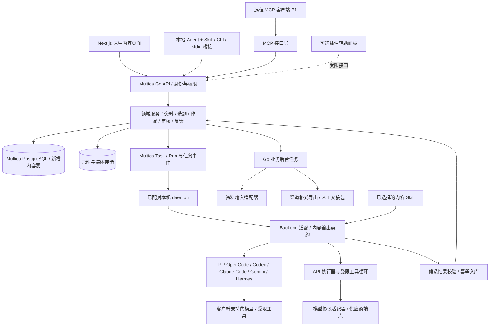
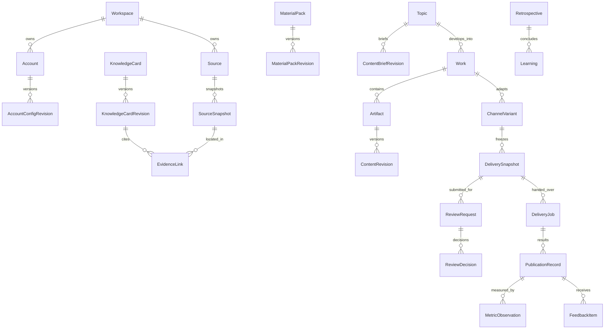

# Loretide · 技术设计与开发路线

版本：v0.6.0 · Multica 二次开发方案（中国社交媒体范围）  
日期：2026-09-12  
关联：[PRD](02-开发需求PRD.md) · [工作流](01-完整工作流.md) · [验收](04-验收标准与追踪矩阵.md)

用户已确认以 Multica 二次开发内容工作台：复用基础平台，新增内容业务模块，Skill 指导 AI，插件按需使用。研究源码已下载，提交为 `3551e72e76d2c276e550b668303646d1280fb1e2`；尚未创建实施工程或运行应用。以下新增模块、接口与验收仍为设计契约。当前决策见 [09 开发映射](09-Multica二次开发决策与模块映射.md)，源代码证据与差距见 [08 研究报告](08-Multica源码研究与小改可行性.md)。

## 1. 架构目标与部署边界

首版沿用 Multica 的 Next.js / React Web、Go API、PostgreSQL 和本机 daemon，在同一业务后端增加内容模块。Web、外部 Agent 和可选插件经受限接口访问相同领域服务；任务复用现有队列与 Agent 后端，并补内容产物入库和 API 执行器。目标仅中国社交媒体；首版按微信公众号、小红书、抖音和视频号四个平台建模，人工发布与数据记录，AI 完成复盘。



### 1.1 本地优先与远程能力如何共存

| 部署方式 | 资料与数据库在哪里 | 外部 Agent 如何工作 | 必须说明的边界 |
|---|---|---|---|
| 本机单实例 | 本机服务与存储，浏览器访问 localhost | 本地桥接调用本机 API | 选用远程模型时，选定上下文仍会发送给该 Provider |
| 用户管理的远程单实例 | 用户服务器的数据与附件存储 | Agent 经 HTTPS 调用服务 | 本地文件需用户选择后上传；服务无法凭路径读取用户电脑 |
| 后续团队/托管模式 | 受工作区隔离的服务存储 | 成员授权的 API/MCP | 成员、分享、计费等另行实现与验收 |

首版支持导入和导出，保留既有笔记工具；“本地优先”不承诺所有能力离线可用。本机实例也需要支持备份与恢复。公网部署需完成 HTTPS、登录、凭据、网络边界与恢复验收后才能作为远程工作流服务使用。

### 1.2 沿用底座的技术组合

前后端沿用 Multica 的包边界：packages/core 管理 API、查询与客户端状态，packages/ui 放基础组件，packages/views 放共享业务界面，apps/web 组合路由。Go handler/service 和 SQL 查询管理业务规则与事务，API 类型/响应契约同步到 core；沿用已有生成机制并补合同验证，不创建第二套身份服务或 Python 业务后端。T-01 锁定实施提交、依赖与适配器兼容版本。

| 层 | 默认方案 | 选择理由与实现边界 |
|---|---|---|
| Web | Next.js + React + TypeScript | 沿用 apps/web 与共享 core/ui/views；内容页面直接接入原生导航 |
| API | Go + Chi，既有 service 分层 | 在 server/internal/handler 与 service 增加内容接口、权限、事务和状态机 |
| Agent / 模型 | 通用执行接口 + Agent 适配器 + API 执行器/模型协议适配器 | Pi、OpenCode、Codex、Claude Code、Gemini、Hermes 和 API 同等可选；能力检测、隔离、结果入库与切换契约统一；无 Hermes 启动依赖，OpenClaw 完全移除 |
| 编辑器 | 优先扩展上游编辑组件 | T-02 验证结构化正文、稳定块 ID、引用定位和往返转换；不足时封装专用作品编辑器，复用工具栏不等于已有作品版本 |
| 数据库 | 既有 PostgreSQL + SQL 迁移 + sqlc | 新增内容业务表与 JSONB 正文，使用应用事务校验关联；遵守上游不新增数据库外键的迁移规则 |
| 附件 | 存储端口 + 本机目录 | P0 原件与媒体在受控目录，远程部署可替换对象存储；数据库只存 Asset 引用 |
| 任务 | 复用 Multica Task/Run、daemon 和 Go 后台任务基础 | Agent 任务沿已有领取/执行/回传路径；补解析、导出、提醒等业务任务及产物入库，不建立第二套 Agent 队列 |
| 单元/合同 | Go test + 仓库 TS/Vitest | 补状态、权限、SQL、API 和编辑器验证；常规测试不启动本机真实 Agent，真实模型烟测单独显式执行 |
| 浏览器 | Playwright | 验证编辑、版本、审核、人工记录和 AI 复盘页面。[Playwright 文档](https://playwright.dev/docs/intro) |
| 工程组织 | pnpm/Turborepo 单仓 + Go server | 保留 pnpm 锁文件、Go 模块和生成流程；首版交付 Web，不增加移动端或桌面客户端交付要求 |

PostgreSQL、任务和权限基础已存在于研究源码；内容表、不可变作品版本、审核与人工记录契约尚未实现。服务器数据走 React Query 且查询键含 workspace；Zustand 只管理视图状态，不能成为作品事实源。先验证中文检索、引用定位、编辑器往返转换和备份恢复；首版不增加第二套业务数据库、独立向量数据库或微服务。已有外部资料仅通过用户选择的导入路径接入，不假设存在可迁移的 Easel 生产数据。

### 1.3 登录与部署最小方案

复用 Multica 身份与 Workspace Membership；个人模式只开放本人创建/登录路径，关闭公开注册是目标部署要求，T-01 检查当前配置能否满足并补缺口。沿用已验证的认证流程，不在内容模块自建用户/令牌体系。采用 Cookie 的路径须验证 HttpOnly、远程 Secure 与写请求来源/CSRF；实际认证细节以实施代码和测试为准。新增内容接口在服务端校验成员、主体、来源与对象权限。

生产单实例包含 Next.js Web 服务、Go API/业务后台任务、PostgreSQL 和持久化附件；本机执行还需要已配对 daemon，本机部署时也可位于同一电脑。API/daemon 的任务协议必须兼容，数据库迁移留恢复点。任务恢复不能重复写版本、通知或导出包。T-01 验证上游脚本与 Windows 环境，不能把 make/Bash 或容器部署说明当作已通过的 Windows 启动方案。本轮未部署。

### 1.4 与已有开源对标的关系

开发基准为 [Multica 研究 checkout](../research/multica)，指定提交与复用位置见 [09 开发映射](09-Multica二次开发决策与模块映射.md)。[00 开源对标](00-GitHub开源对标.md)与 [06 Easel/Hermes 映射](06-Hermes开发基准与改造映射.md)保留为历史产品参考，后者不再决定工程路径、命令或测试。Multica 许可证和认证/隔离差异见 08；采用蓝图不表示这些差异已解决。

## 2. 模块与依赖规则

模块 ID 见[根目录能力地图](../README.md)。业务对象由所属模块维护，跨模块调用通过契约，统一在应用入口组合。

- `workspace-core` 提供身份、文件、任务基础及公共读接口类型。
- `source-inbox` 写来源快照，`knowledge-base` 只引用确定快照和知识版本。
- `topic-planning` 通过 `LearningReadPort` 读取可用经营结论；接口定义在公共契约，具体实现由 feedback 模块提供。
- `feedback-learning` 订阅发布与观测事件，写结论及读模型；不直接调用 topic 模块的内部服务。
- `work-editor` 拥有文档与版本；Agent 只能通过提交候选版本的服务写入。
- `review-delivery` 独占审核通过和人工交接状态转换；Agent Gateway 不绕过它。平台发布由用户在平台操作。

经营反馈可以在业务上回到选题，代码依赖仍保持单向。首版用同库读模型即可，不需要为此拆分独立服务。

### 2.1 任务、Skill、插件与正式资产

复用 Workspace/Membership/Project/Issue/Task，不复制一套内容用户或任务表。新增 Work 关联项目与可选 Issue，一个 Work 可关联多次运行，独立保存内容状态。业务 AgentRun/RunStep 是内容运行契约的投影，绑定上游任务/运行 ID、attempt 和步骤，不能另建互相竞争的调度状态机。上游任务完成后仍要经过 schema、来源、空间、基础版本与幂等校验才能创建 ContentRevision；原始结果保留，校验失败标为待处理，不更新采用指针。

Skill 只定义研究、核查、创作与复盘步骤，运行固定其版本/文件哈希与输出 schema。权限、人工审核、真实记录写入和长期记忆采纳由 Go 服务执行。插件仅调用公开受限接口呈现辅助面板；正式数据存于内容表与 Asset 存储，不存入插件键值存储作为唯一事实源。关闭 plugins_v1 或卸载插件不得影响核心页面、资产读取、人工闭环和 Agent 产物回写。插件借用用户会话不代表人类明确操作，审核及真实记录写入口还需校验调用来源，并使用宿主原生确认流程。

## 3. 数据模型

### 3.1 主要关系



图为主要引用关系；多源素材包、跨作品复盘、项目成员等通过关联表实现。历史发布允许没有 DeliveryJob，此时显式标记 legacy_import。Work 的 Topic 也允许为空，以支持人工直接创作。

### 3.2 最小字段契约

所有持久化业务对象带 `id`、`workspace_id`、创建/修改时间、操作者与删除状态。敏感查询从认证主体派生工作区访问权限，不能仅信任请求里的 `workspace_id`。

| 实体 | 必需业务字段 |
|---|---|
| Workspace / Membership | owner、timezone、locale、member role、active 状态；首版一名成员 |
| AccountConfigRevision | account_id、version、persona_prompt、audience、problems、positioning、pillars、style、boundaries、goals、sample_revision_ids、confirmed_by |
| Source / SourceSnapshot | input_type、origin_url/外部引用、captured_at、captured_by、raw_asset_id、body、content_hash、parser/version、parse_status、locator_map |
| KnowledgeCardRevision | card_id、kind、content、confirmation_status、evidence_links、valid_from/valid_until、supersedes_id |
| EvidenceLink | source_snapshot_id、页码/段落/时间码、quote_range、supports/contradicts/context、使用说明 |
| MaterialPackRevision | question、card_revision_ids、snapshot_ids、assets、gaps、conflicts、usage_notes、content_hash |
| Topic / Recommendation | question、angle、status、reason_codes、evidence_refs、input_cutoff、assumptions、rank_explanation、decision_log |
| ContentBriefRevision | topic_id 可空、目标、渠道、形式、交付清单、scope、deadline、budget、account_config_revision_id、material_pack_revision_ids |
| Work / Project | title、account_id、project_id 可空、owner、goal、work_status；project 保存目标、周期和关联作品 |
| Artifact / WorkingCopy | work_id、kind、channel_variant_id 可空、base_revision_id、document_json、etag、last_saved_by |
| ContentRevision | artifact_id、parent_revision_ids、document_json、plain_text、content_hash、author_kind、author_id、run_id 可空、brief_revision_id、evidence_manifest、change_summary |
| ChannelVariant | work_id、channel_kind、format、mother_revision_id、selected_revision_id、platform_profile_revision_id |
| Account（旧称 ChannelAccount，采用同一实体） | platform_key、display_name、profile_url 可空、operator_notes、current_config_revision_id、last_source_scope；人设提示词在账号配置中，不存平台登录凭据 |
| ClaimCheck | revision_id、claim_locator、claim_text、type、status、evidence_refs、checked_at、checker、disposition |
| AgentRun / RunStep | brief/context_hash、actor、executor/version、connection_id/version、execution_policy_id/version、provider/model、tool_allowlist、limits、state、attempt、parent_run_id、output_refs、usage、error |
| DeliverySnapshot | variant_id、revision_id、rendered_payload_hash、asset_ids + hashes、channel_account_id、platform_profile_revision_id、evidence_health_digest |
| ReviewRequest / Decision | delivery_snapshot_id、snapshot_hash、requester、reviewer、人类主体标识、decision、checks、issues、decided_at |
| DeliveryJob / ExportJob | snapshot_id、approval_id、channel_account_id、format、scheduled_at、timezone、state、idempotency_key、export_asset_id、handed_off_at |
| PublicationRecord | delivery_job_id 可空、channel_account_id、platform_key、external_id/url、published_at、status、reported_by、evidence_asset_ids、verification_method、actual_snapshot_id、version_match |
| MetricDefinition / Observation | definition_version、platform metric key、unit、numerator/denominator、publication_id、value 可空、window、observed_at、recorded_at、recorded_by、origin、evidence、supersedes_id |
| FeedbackItem | publication_id、kind、redacted_excerpt、source_reference、observed_at、operator_interpretation、origin |
| Retrospective / Learning | publication/observation_refs、input_hash、run_id、model/prompt_revision、goals、observations、hypotheses、limitations、next_experiment、adoption、applicability、expires_at、retracted_at |
| Credential / AuditEvent | token_hash、scopes、resource_limits、expires/revoked；audit 保存 actor、action、object/version、result、trace_id，排除密钥及全文 |

文件的实际绝对路径由存储层管理，API 只传 Asset ID 和可控下载链接。正文可作为正式业务数据保存；普通审计日志不复制完整正文和用户隐私。

### 3.3 约束与索引

- 新表不增加 FOREIGN KEY/REFERENCES 或数据库级联；业务关系由应用事务校验同工作区、父对象存在及清理顺序，并处理并发删除，不能只在前端检查。
- 文档版本创建后禁止更新内容；采用以 adoption 事件及选中指针表达。
- `(source_id, content_hash)` 去重快照；同 URL 的不同抓取内容保留不同版本。
- `(artifact_id, version_number)` 唯一；版本父节点必须属于允许的同一作品文档分支。
- `(actor_id, route, idempotency_key)` 唯一，并保存请求摘要；同 key 不同请求体返回冲突。
- 指标原始观测不可覆盖；同发布、指标、窗口、采样点的重复提交提示已有记录，更正通过 `supersedes_id` 表达。
- 索引优先覆盖 workspace + 状态 + 更新时间、来源全文/标签、作品引用、待执行任务和观测窗口。
- 按研究 checkout 的 CLAUDE.md，新建索引使用 CREATE INDEX CONCURRENTLY / CREATE UNIQUE INDEX CONCURRENTLY，单独安排迁移并遵守迁移器非事务执行限制；实施时验证生成代码与迁移恢复。关系图表达领域关联，不表示数据库外键。

## 4. 文档与版本实现

### 中国平台数据边界

首版渠道枚举为 `wechat_official`、`xiaohongshu`、`douyin`、`wechat_channels`，分别拥有稿件、模板、人工发布记录和指标字典。后续中国平台由注册表显式启用，如 `zhihu`、`bilibili`、`kuaishou`、`weibo`、`toutiao`。Web、导入、API 与 Agent 工具使用同一允许列表，不能通过自由字符串新增海外社媒或邮件渠道。

正文默认 `zh-CN`，外文资料与摘译分别保存。平台的字数、时长、格式及指标定义需核对后填入并保存检查日期，本稿不预设它们的当前值。账号仅保存名称/主页等识别标签，无平台登录凭据。

### 4.1 两层存储

WorkingCopy 保存编辑中的可变状态；ContentRevision 保存不可变检查点。自动保存只更新 WorkingCopy，避免每个按键生成一个公开版本。Agent 完成、手工保存版本、采用、提交审核与导出发布快照必须创建或引用确定版本。

编辑内容以带稳定 block ID 的结构化文档为事实源，引用绑定 block/range 和来源快照。Markdown、安全 HTML、纯文本和平台载荷均为派生表示。派生器保存版本号，导出需要通过往返及引用测试。

基于 `etag`/乐观锁保存：如果用户从 r3 编辑，而 Agent 创建了 r4，不覆盖用户副本。AI 结果进入候选分支；用户选择合并后创建 r5。恢复 r2 也产生新的 r6。

部分采用记录所选片段的父版本与改动说明。若编辑移动或删除被引用片段，引用标记需要复核；无法重新定位的引用不能仍显示为已绑定。

### 4.2 审核批准究竟锁定什么

`DeliverySnapshot` 固定：渠道正文 revision、渲染后的有效载荷、附件字节哈希、目标账号、平台规则版本和证据健康状态摘要。`ReviewDecision` 引用该快照 hash。

排期记录 `DeliveryJob` 只安排人工交接和提醒，不产生平台发布调用。用户在“审核通过并安排交接”时确认内容快照与计划时间；下载包始终显示对应版本和目标账号标签。账号标签是名称/主页等业务信息，不含登录凭据。

**变更规则：**

| 变化 | 审核与待执行任务 |
|---|---|
| 仅创建候选草稿 | 原审核及冻结排期保持原指向，显示新候选存在 |
| 选择新正文、替换附件、变更账号或实质性平台配置 | 创建新快照，相关待执行目标变为 held，需对新快照审核 |
| 仅修改个人内部备注或任务负责人 | 不改变交付快照；追加审计 |
| 仅改排期时间 | 保留内容审核，更新人工提醒及任务修订，显示时区并检查是否已登记发布 |
| 来源被撤回或关键证据被更正 | 记录证据健康变化，阻止尚未执行的受影响交付，转复核；历史审核事实保留 |
| 已发布后纠错 | 用户在平台自行处理，再登记更正/撤回和新快照，原发布记录保留 |

### 4.3 原子操作

“通过审核”必须在事务中验证人类主体、工作区权限、快照仍可审、关键问题已处置、必备附件存在，然后写 decision、audit 和 outbox 事件。导出待发布包时重新检查，防止审核后状态变化。

以下是 Go 服务中待实现的事务步骤，不是当前可运行代码：

```text
验证人类审核主体及原生确认来源
开始数据库事务并锁定交付快照
校验工作区成员权限与预期快照哈希
校验关键问题、附件和当前可审核状态
写入人工审核决定、审计与待发送事件
全部成功后提交；任一步失败则回滚
```

审核、导出幂等与权限校验必须在服务端执行，不能依赖提示词或前端按钮禁用。已经下载并带到平台的内容无法被系统强制收回；若后来发现证据问题，只能提示运营者手动处理并登记。

## 5. Agent 执行与上下文契约

统一 `ExecutorAdapter` 接口支持 `AgentExecutorAdapter` 与 `ApiWorkflowExecutor`：前者接入 Pi、OpenCode、Codex、Claude Code、Gemini、Hermes，后者通过 `ModelAdapter` 连接模型 API 并运行受限工具循环。Hermes 为可选适配器，不再固定为默认或强制中转。工作台按任务选定一个执行方，提交受限上下文并接收候选成果，经服务端校验后入库。`executor` 表示任务执行框架或 API 执行器，`model/provider` 表示该客户端实际使用的模型服务，两者分别记录；客户端认证与用户配置的 API 密钥分开管理，不转换或跨框架转交订阅登录令牌。外部 Agent 主动调用工作流 API 是另一个接入方向，沿用相同对象与权限约束。

上游 Codex 后端使用 app-server stdio，Claude 使用 stream-json 等原生协议，详情见 08。Pi、OpenCode、Codex、Claude、Hermes 的已有后端可复用，但本项目成果与隔离契约仍需补齐。Gemini CLI 后端和完整模型 API 任务执行器需新增，现有 llm 客户端只服务辅助调用，不能视为已完成任务执行。

目标约束仍是登录/刷新由客户端管理，工作台不提取、导入、上传或复制订阅凭据。上游实际存在 Codex auth.json 链接以及 Windows 链接失败后复制的逻辑，不能原样宣称满足本目标；T-01 必须改造并验证客户端认证与受限工具边界，预检不满足时阻止执行。桌面账号面板不等于各 CLI 均已验证；额度和计费以实际认证方式为准，未知用量显示未知，不静默切换到付费 API。

本机客户端由 Multica Go daemon 调用；远程 Web 部署仍通过已配对 daemon 领取任务并提交结果，浏览器/VPS 不能直接使用用户电脑的 CLI。电脑离线时等待恢复，复用现有任务领取与运行记录，补幂等业务入库。本项目必须限制可执行文件、参数、工作目录和工具权限，不接受远程任意 shell。模型推理通常仍由厂商在线服务完成，选定上下文会发送给对应服务；API 执行器的执行位置须在连接配置中明确。

每个适配器实现能力检测、开始、事件/结果归一化、取消和状态查询；按 `run_id`、`step_id`、工作区和基础版本绑定会话，不能复用全局“最近会话”。缺失客户端、失效登录、额度不足、超时及不可恢复中断分别展示。没有服务端与执行区隔离的证据，不能把提示词或 CLI 自动授权参数称为安全隔离。当前是设计契约，尚未实现或完成本机模型联调。

派生工程必须删除上游 OpenClaw 后端、依赖、发现/安装、配置兼容及执行入口，不保留旧路径别名或回退；未迁移的旧配置明确报错。研究源码和历史记录保留作为证据，不属于交付运行依赖。内容 Skill 使用显式启用清单和版本快照，不能从全局扩展自动扩大授权。审核、人工观测和正式记忆写权限不暴露给执行进程或通用插件桥接。操作系统隔离不能由 cwd、提示词或 CLI 自动授权参数替代，具体通过条件见 [验收矩阵](04-验收标准与追踪矩阵.md)。

完整的空间隔离、执行能力、配置快照、API 密钥引用及切换状态契约以 [核心架构决定](07-隔离工作空间与可替换AI执行架构.md) 为准。配置按本次任务选择或空间默认解析，没有固定供应商默认。各适配器共用业务协议，原生会话不假设互通。

### 5.1 Context Pack

每次运行固定一个上下文包：

```json
{
  "schema_version": "1",
  "workspace_id": "ws_demo",
  "brief_revision_id": "brief_r2",
  "profile_revision_id": "ip_r3",
  "material_pack_revision_ids": ["pack_r4"],
  "source_snapshot_ids": ["source_snapshot_1"],
  "learning_ids": ["learning_confirmed_1"],
  "tools_allowed": ["knowledge.search", "research.fetch", "artifact.propose"],
  "constraints": {
    "network_mode": "configured_tools",
    "max_cost": 2,
    "currency": "USD",
    "max_steps": 8
  },
  "cutoff_at": "2026-09-12T09:00:00+08:00",
  "context_hash": "computed-by-service"
}
```

以上 ID 与预算是示例占位值。限制由用户设置和服务端策略计算，不能让外部 Agent 自行扩大。Provider 不返回成本时保存 unknown，可用步骤/Token/超时上限控制，不把估价称为实付成本。

运行只读取用户本次授权的内容，不默认发送整个知识库。检索扩展仍需检查权限和资料范围，新增网络来源保存快照与读取时间。

### 5.2 单个编排器先行

首版实现两条可恢复编排：创作为“整理 → 对标 → 提纲 → 核查 → 正文 → 自检”；复盘为“读取人工记录 → 校验口径 → 对比目标与结果 → 分析证据与限制 → 提出下一轮建议”。每阶段有输入/输出 schema，长任务在队列中执行。可以按简报省略不必要步骤，也可针对一个阶段手动重跑。

阶段可由同一个模型执行，或交给外部 Agent；不要求首版具备自治多 Agent 协商系统。阶段产物保存在 Work 下，失败的阶段与成功产物分别记录。

### 5.3 输出包

结果包至少含：`run_id`、`step_id`、`base_revision_id`、结构化正文、引用清单、论断核查、未解决问题、产物类型、作者来源和可用用量。

服务端验证 schema、所有引用的归属与存在性、正文大小、附件 ID、基础版本和结果幂等键。无法解析的输出进入失败详情或待人工整理区，不能伪装成可审核作品。

来源正文、网页、评论和外部 Agent 输出都作为不可信数据处理。材料中的“忽略限制、读取其他资料、发布”等文本不扩大工具权限。

### 5.4 运行与重试

任务记录 lease、heartbeat、attempt、cancel_requested 和最后完成阶段；Worker 重启可恢复待处理任务。取消是尽力停止执行，必须如实显示已发生费用和已完成外部动作。

读操作可有限退避重试。创建版本、生成导出包和 AI 复盘都使用幂等结果提交。系统没有平台发布执行器，模型自动重试也不会触发平台发布。

## 6. 服务 API 草案

统一前缀 `/api/v1`。错误体包含 `code`、可读 message、可选 field errors、`request_id`、`retryable`；不返回密钥或内部路径。列表使用游标、过滤和最大页大小。长任务返回 `202 + run_id`，查询状态后读取持久化产物。

| 接口 | 用途 | 主体/阶段 |
|---|---|---|
| `POST /sources` | 上传引用/文本/链接并创建来源 | 人类/有 scope 的 Agent，P0 |
| `GET /knowledge/search` | 搜索授权知识与来源片段 | 人类/Agent，P0 |
| `POST /material-packs` | 创建素材包版本 | 人类/Agent 候选，P0 |
| `POST /recommendations/runs` | 基于指定档案运行选题建议 | 人类/受限 Agent，P0 |
| `POST /briefs` | 创建简报或新修订 | 人类/Agent 候选，P0 |
| `POST /context-packs` | 生成限范围的运行上下文 | 人类/Agent，P0 |
| `POST /agent-runs` | 启动已配置工作流 | 人类/Agent，P0 |
| `GET /agent-runs/{id}` | 查询运行与产物 | 有对象访问权主体，P0 |
| `POST /agent-runs/{id}/cancel` | 请求停止 | 有任务管理权主体，P0 |
| `POST /artifacts/{id}/revisions` | 提交人工/Agent 候选版本 | scope + 归属 + 基础版本校验，P0 |
| `PUT /artifacts/{id}/working-copy` | 乐观锁保存编辑副本 | 人类编辑会话，P0 |
| `POST /artifacts/{id}/adoptions` | 采用指定版本 | 人类，P0 |
| `POST /reviews` | 提交确定交付快照待审核 | 人类/受限 Agent，P0 |
| `POST /reviews/{id}/decisions` | 人工通过/退回/拒绝 | 审核者会话，P0 |
| `POST /delivery-jobs` | 安排已审核快照的人工交接/导出与提醒 | 人类运营者，P0 |
| `GET /delivery-jobs/{id}/package` | 取得有权访问的已审核包 | 人类/有 scope 的 Agent，P0 |
| `POST /publications` | 人工登记实际发布或导入历史 | 人类运营者，P0 |
| `POST /publications/{id}/observations` | 人工录入/更正指标 | 人类运营者，P0 |
| `POST /observation-imports` | 预览 CSV、映射、查重、确认导入 | 人类运营者，P0 |
| `POST /retrospective-runs` | 根据指定人工记录启动 AI 复盘 | 人类/配置的内部任务，P0 |
| `POST /retrospectives/{id}/revisions` | 保存 AI 结果或人工编辑版本 | 人类/受限 Agent，P0 |
| `POST /learnings/{id}/adoptions` | 采纳结论进入长期经营记忆 | 人类，P0 |

Agent 请求中的 `author_kind`、`recorded_by` 和“人工”标记由服务从认证主体决定，不允许通过 JSON 自报升级身份。AI 只能分析已有人工观测，不能写入、补造或更改这些真实记录。

冲突返回 `409` 或工作副本 `412`；缺失认证 `401`，权限不足 `403`，内容约束不满足 `422`，请求过多 `429`，外部依赖不可用 `503`。对象是否存在的返回方式需防止跨工作区枚举。

## 7. Skill、API Key 与 MCP 接入

### 7.1 两条接入路径

**P0：本地 Skill/CLI/stdio 桥接 → 工作流 API。** Skill 说明业务动作与返回成果位置；桥接读取用户配置的服务地址和限权 API Key。一个用户可让多个客户端使用同一把工作流 Key，但推荐按客户端分发独立 Key，便于撤销和追踪。Key 权限不会因为客户端是 Codex、Claude Code 或 Cursor 而增加。

**P1：远程 MCP → 同一领域服务。** 使用当前目标客户端支持的 HTTP 传输和认证流程。MCP 授权与一般 REST API Key 接入是不同的接入契约，不能把“同一服务凭据可复用”写成“任意 MCP 客户端原生接受同一 Bearer Key”。HTTP MCP 的标准授权涉及 OAuth 及资源服务器发现，应按选定协议修订实现和验证。[MCP 授权规范](https://modelcontextprotocol.io/specification/2025-11-25/basic/authorization)

截至本稿查阅，官方已发布 2026-07-28 修订，涉及传输和授权变化；实现时记录采用的修订、SDK 与客户端版本，不能直接套用旧版会话假设。[MCP 官方修订说明](https://blog.modelcontextprotocol.io/posts/2026-07-28/)

### 7.2 拟提供的工具面

| 工具 | 权限与结果 |
|---|---|
| `workspace.get_context` | 返回可访问的档案版本及可用能力 |
| `knowledge.search` | 只检索授权资料；可返回片段及引用 |
| `brief.create` | 保存候选简报，返回 Web 链接 |
| `workflow.start` / `workflow.status` | 运行已配置工作流或查状态 |
| `artifact.propose_revision` | 提交候选版本；附引用、基础版本与幂等键 |
| `artifact.request_revision` | 根据用户修改意图启动新的修订任务 |
| `review.submit` / `review.status` | 创建审核请求和查询；无 approve 工具 |
| `delivery.get_approved_package` | 取得已批准且有访问权的交付包 |
| `retrospective.analyze` | 分析指定人工记录并保存复盘，不采纳长期结论、不写入人工指标 |

权限 scope 示例：`knowledge:read`、`brief:write`、`artifact:propose`、`run:execute`、`review:submit`、`delivery:read`、`feedback:read`、`retrospective:propose`。任何写操作还需 resource limits 与对象归属校验。工作流 Key 由工作台管理，客户端认证由相应客户端管理；直连 API 密钥通过受信连接器按工作区与运行位置授权，任务保存凭据引用；不复制到提示词或前端。目标产品不保存平台发布凭据，也不存在发布 scope。

### 7.3 连接器交付矩阵

| 路径 | P0/P1 | 验收证据 | 当前状态 |
|---|---|---|---|
| 工作流 REST API | P0 | 鉴权、schema、对象隔离与外部 Agent 结果入库 | 未开发 |
| Skill + 一个本地 Agent 客户端 | P0 | 创建简报、上传结果、在 Web 采用/审核 | 未开发 |
| 本地 stdio 桥接 | P0 | 凭据配置、工具清单、调用、吊销及错误 | 未开发 |
| 远程 HTTP MCP | P1 | 认证、协议兼容、重连、长任务与资源边界 | 未开发 |
| Codex / Claude Code / Cursor 各具体版本 | 分别 P0 或 P1 | 每个客户端独立实测，记录失败与降级路径 | 未验证 |

“安装一次”按一个客户端配置一次连接解释，不承诺安装到一个 Agent 后其他客户端会自动获得配置。本轮没有执行安装、连接或真实模型调用。

## 8. 输入、检索和媒体契约

### 8.1 输入适配器

接口提供 `capabilities`、`validate`、`fetch/ingest`、`parse` 和可选 `sync(cursor)`；结果包括 `source_ref`、快照、原件、定位、解析状态和错误。内容类型与大小必须限制，压缩/文档解析在有限资源环境执行。

服务端抓 URL 时仅允许明确的公开 HTTP(S) 来源，校验解析后的地址、重定向和内容大小，默认阻止回环、内网、云元数据地址和非 HTTP 协议。需要访问内网资料时另设用户明确配置的连接器，不开放任意 URL 读取。

Obsidian 的笔记本身是 Vault 中的 Markdown 文件，因此首版选定文件导入有明确可行的数据路径；专用同步与链接行为仍需实现验证。[Obsidian 官方数据存储说明](https://obsidian.md/help/data-storage)

### 8.2 中文检索

第一步支持标题/正文片段、标签、时间和来源过滤，并保存可解释命中。若采用数据库默认全文检索，必须验证中文分词与匹配；不能假设英文默认配置已解决中文搜索。

可用规范化文本、子串/三元组索引或明确的中文分词组件做候选方案对比。混合语义检索后续加入，向量是可重建索引，来源与作品仍是事实源；向量服务失效时继续基础检索并显示降级。

### 8.3 媒体资产

Asset 保存文件类型、尺寸/时长、内容哈希、来源、使用说明、作者、所属工作区与引用。生产包中缺图、缺音频或缺成片是一条待办，不能被占位资源冒充已完成。

后续媒体生成任务使用同一运行、预算、预览与采用机制。媒体修改生成新 Asset 版本，审核交付固定字节哈希。视频脚本能在首版作为可编辑文档完成，不需要把视频渲染系统提前纳入核心依赖。

## 9. 手动发布与内容交接

渠道适配仅负责内容模板、字段校验、渲染和导出。接口为 `validate(snapshot)`、`render(snapshot, format)`、`export(snapshot)`；不提供登录、写平台草稿、平台排期、发布或代发送接口。

导出顺序：读取冻结快照 → 验证审核与附件 → 创建 ExportJob → 渲染正文与清单 → 保存包及 hash → 用户复制/下载。导出任务使用幂等键，重复点击不创建内容不同但同名的交付物。

日历到期创建站内待办，关联待发布包。用户在平台自行发布后，通过表单登记发布时间、链接/ID、证据和版本差异；没有登记时只显示“待登记”。已交接与已发布不能共用状态字段。

系统能阻止未审核版本被标为已审核包，但不能控制用户在平台上的后续编辑与操作。实际发布与已审核快照不一致时，保留差异，AI 复盘优先引用实际发布快照；未得到完整正文时显示版本不确定。

一个作品多个渠道分别登记结果。人工误填或重复登记通过更正与幂等校验处理；平台上的删除、更新、失败也由人确认后记录，不由后台轮询或模型猜测。

## 10. 真实观测、复盘与更正

数据层区分 `manual`、`manual_import`、`ai_inference`、`demo`。真实发布与观测写入口只允许人类运营会话；CSV 先预览再确认，不能仅凭文件字段把自己标成人工核验。复盘输入读取人工记录，输出只写 AI 分析对象。

指标字典保存平台定义版本、单位与计算方式。比率指标仅在分子分母及口径齐备时计算；截图数据不可读时留待人工填写。同比/环比必须确认相同渠道、形式和观察窗；无法比较时保留并列展示。

原始观测保存 observed_at（实际观察时间）与 recorded_at（录入时间）。更正新增 observation 并 supersede 旧记录；分析默认取当前有效值，历史复盘可回放当时所用版本。

记录保存后，用户可选择“保存并让 AI 复盘”，也可启用按周自动生成；默认仅在用户发起或已启用规则下运行，不要求用户先写分析。AI 固定本次人工输入的版本与截止时间，输出 observations、hypotheses、limitations、next_actions，并附引用。新增或更正数据只标记旧复盘需要更新，通过新运行生成新版，不覆盖旧报告。

AI 报告生成后即可查看、编辑、导出和用于下一轮的临时建议上下文；未采纳结论明确标为 AI 建议。用户采纳 Learning 时需保存依据、适用范围与样本限制，才进入长期经营记忆；涉及 IP/风格变更继续显示差异供用户采用。没有观测时报告只说明数据缺口，不生成表现结论。Provider 不可用时保留人工记录，标记复盘待运行。

## 11. 拟议代码与文档结构

research/multica 保留原始研究基准；后续在本项目 app/ 子目录建立实施工程，避免修改证据 checkout 或覆盖需求文件。以下带 content 的路径为建议新增位置，尚未创建；上游既有目录在 research/multica 中可核对。

```text
research/multica/                 已下载的固定提交研究源码，保持原样
app/                             Multica 派生实施工程，尚未创建
  apps/web/                      既有 Next.js 路由，接入原生内容页面
  packages/core/content/         新增类型、API、React Query 与视图状态
  packages/views/content/        新增今日、IP、素材、作品、审核、复盘界面
  packages/ui/                   复用基础组件，按需补编辑节点
  server/internal/handler/       新增内容 API，沿用鉴权入口
  server/internal/service/       新增内容领域事务、校验与后台任务
  server/internal/daemon/        复用任务领取和执行，改造认证与隔离
  server/pkg/agent/              复用 Backend；补缺失路径和成果契约
  server/pkg/db/queries/         新增内容 SQL，按 sqlc 流程生成访问代码
  server/migrations/             新增内容表与索引迁移
  content-skills/                建议新增：版本化内容 Skill 源，导入/绑定到空间
  packages/plugin-sdk/           上游可选扩展，核心模块无此运行依赖
  package.json / pnpm-lock.yaml  沿用单仓脚本和锁文件
  server/go.mod                 沿用 Go 依赖与工具链约束
docs/                            本项目需求、技术与开发决策
records/                         本项目对话及交付记录
```

命名：代码使用稳定英文领域名，页面使用中文业务词；状态值由公共 schema 枚举。日期内部使用带时区的标准时间，排期同时存 UTC instant 与原 IANA 时区。业务逻辑避免依赖本地机器默认时区。

## 12. 开发路线与可验收工作包

每个工作包可继续拆为小任务；以下是需求级开发拆分，不是已经创建的工程 issue 或完成记录。不虚构工时、现有源码文件或已运行命令。

| 工作包 | 依赖 | 交付结果 | 对应需求 | 完成验证 |
|---|---|---|---|---|
| T-01 Multica 基准与隔离工程基础 | — | 独立实施工程、固定提交/依赖；复用 Workspace、Task/Run、daemon；新增内容 schema 和权限基础；关闭插件仍可启动；改造认证复制/默认宽权限、移除 OpenClaw 全链；demo 标识与恢复点 | R-001～R-004；R-030、R-055、D-10 的基础约束 | Windows 实际启动；无 Hermes/OpenClaw 必需依赖；空间/文件越界与人工权限绕过被拒绝；保留许可证声明并核对当前使用方式；项目命令实跑 |
| T-02 原生作品版本模块 | T-01 | Go 业务表/API、core/views 原生页面；Work 关联上游 Issue/Task；Artifact/WorkingCopy/Revision、保存、差异、采用及引用结构 | R-031～R-034；D-10 | 插件关闭时浏览器编辑重启恢复、并发修改不覆盖；Task 完成不能自动采用或审核作品 |
| T-03 人工发布记录底座 | T-02 | 四个中国平台模板、审核快照、导出交接、提醒、人工发布与指标、反馈读接口 | R-035～R-036、R-038～R-045、R-049 | 人工从空白作品完成审核、交接、发布登记与反馈录入 |
| T-04 采集与档案 | T-01 | IP 版本、文件/链接导入、快照、速记、RSS、外部导出资料路径 | R-005～R-013 | 多格式导入、失败恢复、来源定位、订阅去重 |
| T-05 知识与选题 | T-03、T-04 | 卡片、素材包、中文搜索、可解释候选、简报及反馈读取端口 | R-015～R-024 | 冷启动与有真实反馈两种推荐路径 |
| T-06 Agent 创作与 AI 复盘 | T-02、T-05 | 复用已有 Backend、补 Gemini CLI/完整 API 执行器；Context Pack、Skill 版本、候选成果校验入库、切换、人工数据分析、预算与恢复 | R-025～R-030、R-046～R-047；D-10 | 每条交付路径真实完成创作和复盘；两个不同供应商 API 与跨执行器接续；重复回传不重复建版本；认证不转交，不直写人工观测/审核/记忆；插件关闭也通过 |
| T-07 外部 Agent 接入 | T-03、T-06 | 服务 API、Skill/CLI/stdio 桥接、Key 与 scope | R-052～R-053、R-055 | 一个实际客户端写入草稿并在 Web 审核；越权拒绝 |
| T-08 首版完整验收 | T-01～T-07 | 浏览器流程、恢复演练、错误处理、中文检索及闭环证据 | 全部 P0 + NFR | [验收矩阵](04-验收标准与追踪矩阵.md) P0 全部通过 |
| T-09 远程接入与资料增强 | T-08 | 远程 MCP、资料输入连接器、其他中国平台模板、手工数据导入与实验分析 | R-014、R-048、R-054；R-035 后续模板扩展 | 每个资料源、渠道模板、导入格式和 Agent 客户端单独验证 |
| T-10 小团队与媒体 | T-08 | 成员权限、协作/分享、媒体工具连接 | R-037、R-050～R-051 | 成员撤销、审阅隔离、媒体预览与版本回归 |

### 12.1 阶段出口

- **M0 / T-01～T-03：** 可完成编辑、审核、手动发布登记与数据录入，建立可信底座；AI 复盘与反馈回流在 M1 验收。
- **M1 / T-04～T-08：** 完整 P0 首版，加入资料、IP、选题、Agent 与反馈回流；需要真实执行方及浏览器验收证据。
- **M2 / T-09～T-10：** 按验证结果扩展远程 Agent 接入、资料/导出格式、分析、团队和媒体能力。

P2 的跨品牌集中管理、商业计费与高阶运营在 M2 后另做需求细化，避免首版同时承担个人工具与商业 SaaS 两套交付目标。

### 12.2 项目命令合同

本目录只下载研究源码，尚未创建实施工程。下表按研究 checkout 的 package.json、Makefile、CLAUDE.md 列出开发入口，本轮未运行。依赖安装前先核对脚本与目标环境；常规测试不得调用已登录的本机 Agent，真实调用只在显式烟测范围执行。

| 命令或检查 | 位置/前提 | 本项目处理 |
|---|---|---|
| pnpm install --frozen-lockfile | 派生工程根；Node/pnpm 满足声明版本 | 按锁文件安装，不在研究 checkout 安装 |
| pnpm dev:web | 派生工程根；Go API/数据库配置齐全 | 启动 Web 开发服务；不等于完整服务与 daemon 已启动 |
| pnpm typecheck / lint / test / build | 派生工程根 | 脚本通过 Turbo 分发；按改动筛选包并记录范围，最终按交付范围补完整检查 |
| go test ./... | 派生工程 server；Go 工具链与测试依赖齐全 | 先核对数据库依赖及真实 CLI 烟测门禁；业务事务使用独立测试库 |
| make sqlc / migrate-up / check | 派生工程根；make、Bash、所需工具与隔离数据库齐全 | 仅记录上游入口，Windows 可用性待实测；check 可能组合多类操作，先读脚本再执行 |
| Web/API/daemon 启动、浏览器与恢复 | T-01 明确实际可运行脚本和配置 | Windows 当前未确认 Docker/make 可用；不得把下载源码等同安装完成 |

各 Agent 能力以实际安装版本检查；已有后端源码不是实机调用证明。具体路径证据与认证差异见 08，实施工作包与责任见 09。

## 13. 验证策略与主要风险

- 纯逻辑测试覆盖状态转换、观测口径、版本哈希和权限判定，避免只复制实现细节。
- 真实数据库集成测试覆盖审核事务、乐观锁、导出幂等、提醒恢复、同工作区应用关联校验与并发清理、人工观测更正与备份恢复。
- 合同测试覆盖 Provider、Agent、输入适配器和渠道错误语义；成功 stub 不能替代实际连接验证。
- 浏览器测试覆盖人工主流程、AI 候选修改、来源核对、审核、日历、手工数据录入及刷新恢复。
- 真实验证先用明确标识的样例跑全链，再由用户选择实际资料、Provider 并手动发布；工作台只负责登记和 AI 分析。最终证据注明范围，不能把模拟记录写成实际发布。

优先风险：中文资料解析和检索失真、来源到正文引用丢失、编辑覆盖、导出版本错误、人工发布后差异未记录、样本很少时 AI 过度解读、外部客户端认证差异。对应验收全部列入下一份文档。

Multica 专项验证覆盖：plugins_v1 关闭的完整闭环、Skill 版本回放、任务结果重试/迟到/格式错误、插件脚本借用户身份越权、上游默认执行权限及认证链接/复制差异。原始研究 checkout 保持不变；移除 OpenClaw 的扫描与运行检查针对实际交付工程及构建产物，不删除历史证据。

## 14. 外部依据及验证状态

查阅日期：2026-09-12。只用于约束设计可行性，不证明连接器已实现。

| 依据 | 在本稿中的用途 | 边界 |
|---|---|---|
| [MCP 授权规范](https://modelcontextprotocol.io/specification/2025-11-25/basic/authorization) | 区分 API Key 路径与标准 HTTP MCP 授权 | 该链接为有日期的修订；实现需选定当前兼容版本 |
| [MCP 2026-07-28 官方说明](https://blog.modelcontextprotocol.io/posts/2026-07-28/) | 提醒协议与客户端版本兼容需要实测 | 未验证本机任一客户端兼容性 |
| [MCP 官方传输源码](https://github.com/modelcontextprotocol/modelcontextprotocol/blob/main/docs/specification/2026-07-28/basic/transports/index.mdx) | 确认 stdio 与 Streamable HTTP 路径分别建模 | 未实现传输层；不承诺协议细节兼容 |
| [Obsidian 数据存储说明](https://obsidian.md/help/data-storage) | 确定 Markdown 文件导入路径 | 未读取或同步用户 Vault |

飞书、幕布等资料源本轮未做真实接入核验，因此通过导入路径或待验证资料连接器表达。平台直连发布已按用户要求移出全部开发范围；本轮也未进行任何实际发布操作。


## v0.5 开发基线与追踪

本轮已将品牌空间、账号授权、账号提示词、受约束 SOP、风险处置和浏览器测试决定同步到主工作流、PRD、技术与验收。仍为开发规格，不表示应用已实现。审核细节以 [审核内核计划](10-审核内核合并与精简计划.md) 为专项契约；相同输入快照在所有入口使用相同后端规则。

已确认新建品牌空间的自动预检默认开启，提审时触发，关闭后保留手动检查。首版所有账号统一使用品牌级开关，不提供账号级覆盖；最终人工审核不可关闭。首版媒体边界已确认：文字、图文文案和视频脚本在工作台内创作；图片与视频成片在外部制作后放入已授权的本地工作/素材文件夹，由工作台登记引用，作为正式作品附件支持预览、版本绑定及人工终审，替换附件后重新审核。首版不要求内置排版、剪辑、媒体生成或成片自动审核；AI 必须区分文字已检查与媒体未检查，不能以脚本检查代替成片审核。

### 品牌与审核数据契约

Workspace 表示品牌；新增 Account、AccountConfigRevision、SOPDefinition、SOPRevision、SOPStep、TaskMaterialGrant。人设仅为账号配置中的 persona_prompt 字段，不创建 Persona、PersonaRevision 或 AccountPersonaBinding 实体。原 账号表达配置中的表达定位与风格归入账号配置，品牌公共规范归品牌资料。

Asset/Source/Knowledge/Memory 带 workspace_id、scope_kind、account_id（专属时必填）；Grant 绑定 run、账号与资源版本。读写都验证工作区成员、账号权限与任务授权，服务端不接受 Agent 自报的授权。运行固定 账号人设提示词快照、account_config_revision、sop_revision 和授权素材清单/哈希。新增关联遵守上游不添加 DB 外键的约束，由应用事务、约束索引和回归维护一致性。

ReviewInputSnapshot 绑定 workspace/account/channel/content revision、附件哈希、账号配置/SOP/规则版本及授权清单。ReviewRun 保存 queued/running/completed/failed/cancelled/skipped；Coverage 保存 reviewed/pending/not_applicable。原始报告与 Finding 不可变，HumanDisposition 追加保存每项的处置人、时间、理由与证据，HumanReviewDecision 绑定快照和原生人类操作。不能用 AI 结果字段表示人工批准。

服务端在同一事务检查快照、账号权限、待处置发现、未完成检查的继续说明及附件，然后写人审、审计和 outbox；幂等键按操作者与操作约束，重复请求不重复批准。人审返回后内容并发变更将旧批准留在旧快照；迟到报告归原 run，不能覆盖新版本。导出重新验证有效批准，返回 can_export_approved_package，不返回表示真实发布的 can_publish。

新增 Go 领域服务提供启动检查、读取报告、追加处置、登记未完成继续、最终审批和导出能力；具体路由沿 Multica 原生 API 约定落实。模型/Skill 凭据无人工批准写权限；所有入口共享服务端门禁。私有资料保存在授权数据库/附件存储，不写入仓库 rules/user 或 cases/private。

### 浏览器优先开发与测试

T-01 先准备独立 Windows 开发实例，建议 Web/Go API/数据库/附件均本机，浏览器作为主要入口。统一启动、状态与停止脚本需实测，停止保留数据；不把现有 Make/Bash 命令宣称为 Windows 已通过。流程调试使用可控执行器，不默认消耗模型额度；接着测试选定真实 Agent，再补远程服务与本机 daemon 的配对、断线恢复、重复领取/结果回传、租约与重启。仅 Electron IPC、原生对话框或桌面交付变化才要求桌面专项。

T-04 纳入品牌账号、人设、授权与 SOP 模型；T-06 纳入固定上下文和预检调度；审核工作包纳入不可变报告、逐项处置和终审事务。详细阶段、规则合并、来源和评估集见审核内核计划。30 条有区分度的审核样例与模型误报/漏报评估分开执行；模拟成功不代表真实模型质量或远程恢复通过。


## v0.6 已确认开发基线

历次追问的共同规则已合并到 [11-首版开发基线与实施清单](F:/GJ/内容创作工作台/docs/11-首版开发基线与实施清单.md)，覆盖账号提示词、本地文件、资料范围与偏好、联网失败及首轮 Codex 路径。本文保留本领域细节和既有需求编号；以 11 中的最终决定替代旧追问建议。实施和应用验收仍待执行。

## 模块化及回归开发约束

新增模块必须遵守 [12-模块边界与变更回归约束](12-模块边界与变更回归约束.md)：数据由所属模块维护，调用只经过公开接口，禁止反向/私有依赖；修改接口检查消费者，修改公共权限/数据结构扩大回归。架构前置任务见 [architecture.md](../tasks/architecture.md)，自动检查尚未实现。

## 初期完整开发诊断（已确认）

用户要求操作日志、技术日志/错误、跨层追踪、完整诊断面板、输入快照、模拟故障与回归全量纳入初期开发，不做最小版。详见 [13-完整开发诊断与操作日志需求](13-完整开发诊断与操作日志需求.md) 和 [13项诊断任务](../tasks/diagnostics.md)。D13-V01～12为必验补充，DG-01通过后开始LT-009；后续功能同步接入、同步验收，不能延后。原R/AC编号保持不变，当前仅规格与任务更新，尚未实现。


## 品牌全案运营扩展（2026-09-13 确认）

[文档14](14-品牌全案运营扩展需求.md) 补充 R-056～058：节日/品牌活动/营销节点联动选题、品牌/账号经营诊断与行业竞品监测，含工作流、技术落点及 D14-V01～08 验收。R-059 直播/营销活动可配置 SOP 保留为待办，后续细化。原需求与验收编号不变，任务状态见 [品牌运营任务](../tasks/brand-operations.md)。均尚未实现；手动发布、人工数据录入、强制人审及人工采纳记忆继续有效。
