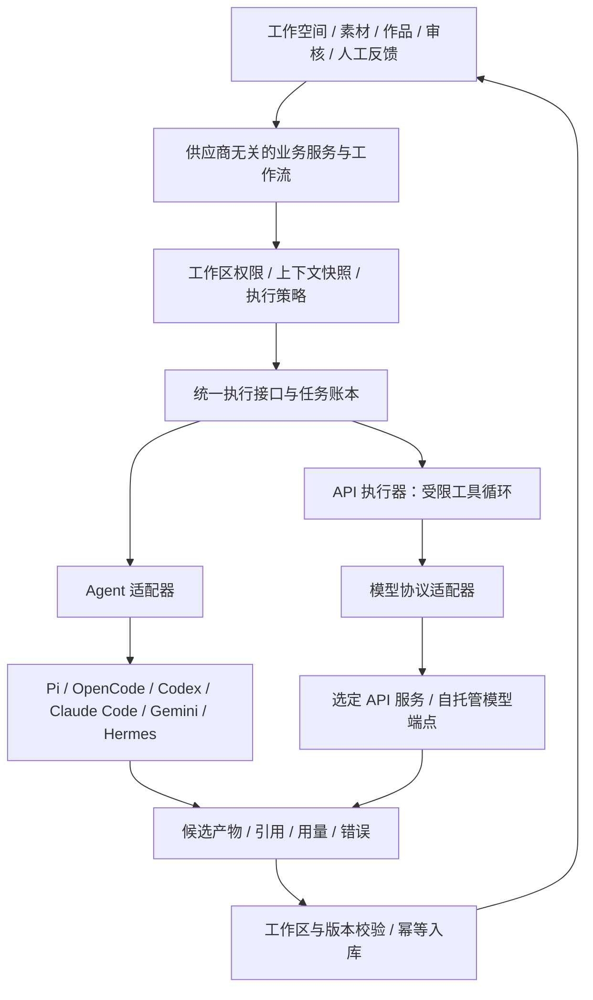

# 隔离工作空间与可替换 AI 执行架构

版本：v0.6.0 · 核心架构决定  
日期：2026-09-12  
状态：已接受，待开发与实际验收。供应商无关与隔离契约继续有效；v0.5.0 按 D-10 改用 Multica 二次开发，替代旧 Easel 工程映射，见 [09 开发决策](09-Multica二次开发决策与模块映射.md)。

## 1. 核心决定

工作台业务核心不依赖某个模型供应商或 Agent 框架。知识、IP、作品、版本、审核和人工反馈归工作台所有；执行器只能领取授权任务并提交候选成果。安装或移除任一执行器不能破坏业务数据或人工流程。

用户可选择 Pi、OpenCode、Codex、Claude Code，亦可直接使用模型 API；Gemini 和 Hermes 保留为同等地位的目标适配器。Hermes 不是强制依赖或固定默认，不要求经 Hermes 中转。上游已有五类目标 Agent 后端，Gemini CLI 和完整 API 执行器需新增；源码存在与本项目验收通过分别记录。OpenClaw 完全移除，通用架构不意味着重新加入已排除的运行时。

首版一个品牌一个隔离工作空间，内部支持多个账号及各账号人设提示词、项目与 SOP。品牌公共资料可授权复用，账号专属资料按任务授权；提示词相同不共享专属资料。团队成员协作为后续增强，多账号及账号人设提示词属于当前模型。

## 2. 分层与两个切换维度

| 配置维度 | 含义 | 边界 |
|---|---|---|
| Executor | 谁执行步骤和工具：Pi、OpenCode、Codex、Claude Code、Gemini、Hermes 或 API 执行器 | 工具权限、会话方式和取消能力由适配器申报，不假设相同 |
| Model connection | 具体 provider、endpoint、model 和认证引用 | 只能选择该执行器实际支持的组合；不承诺每个 Agent 都能调用任意厂商模型 |
| Execution policy | 当前空间允许的输入、输出、网络、工具、预算及执行位置 | 切换执行器或模型不能放宽策略 |

配置优先级：用户本次任务选择 → 该空间已保存的默认配置。初次未配置时保持 AI 待配置，人工操作可用；没有全局固定供应商，也不自动使用其他空间的配置。UI 明确区分未配置、未安装、未认证、不可达、能力不足与可用。

## 3. 工作空间隔离契约

| 边界 | 必须实现的约束 |
|---|---|
| 业务数据 | 从登录身份和成员关系派生工作区权限；所有对象、引用、附件、检索、缓存、导出、后台任务与事件均受工作区约束。换 workspace_id、对象 ID 或订阅频道不能越权。 |
| 文件和进程 | 每次运行独立执行区；只读输入快照、可写临时区与候选输出区。正式数据库、原始资产、其他空间、用户非授权目录不暴露给 Agent 工具及其子进程。路径校验覆盖规范化、符号链接和 Windows junction；仅设置 cwd 不算隔离。 |
| 会话与记忆 | 会话键至少包括 workspace、executor、connection、run；执行器原生会话 ID 由服务端保存并绑定，不接受客户端任意指定。只注入本空间批准的上下文与经营记忆，不自动继承其他任务会话、全局提示词或扩展。 |
| 凭据与配置 | API connection 绑定允许使用的工作区与执行位置；任务只保存 credential_ref。实际密钥仅在受信连接器中解引用，不进入模型文本、候选文件或普通日志。连接地址由有权限的用户配置，材料不能改写端点。 |
| 工具与网络 | 工具、扩展、MCP 服务和网络目标按工作区策略明确启用；来源中的指令不得授权工具。模型无权直接写正式观测、审核结果或长期记忆。 |
| 运行生命周期 | 切换空间时取消旧页面请求/订阅并隔离缓存，迟到响应不得渲染到新空间。运行仍绑定原空间；空间授权撤销后停止领取新任务，拒绝后续越权提交。 |

共享同一厂商登录账号可共享额度，但不代表共享上下文或工作区数据。官方客户端的认证材料留在其受信认证边界中；模型可调用的文件/终端工具不能因此获得整个用户目录。如何兼顾客户端认证与工具进程隔离必须逐适配器验证，不能把整个 home 挂载进执行区当作解决方案。

Windows 沙箱实现作为 T-01 的必交付：记录具体机制、支持的客户端版本、读写/子进程/网络边界及逃逸测试。不能执行当前空间要求的隔离策略时，在预检阶段拒绝任务；不得以“普通权限运行”静默降级。远程 Web 调用本地执行器仍需要设备配对与任务归属校验。

## 4. 统一执行契约

以下为本项目待实现的接口，不是各厂商已提供的同名 API。

| 操作 | 职责 |
|---|---|
| describe / probe | 声明能力及客户端版本；检查安装、连接、认证可用性与隔离策略，区分静态检测和实际模型调用 |
| start | 验证 ExecutionRequest 后启动任务，返回本项目运行 ID 与适配器执行引用 |
| events / status | 归一化真实进度、工具请求、候选成果、状态与错误；不伪造 token 流 |
| cancel | 请求终止并报告确认/尽力/不支持；未确认终止不能标为已停止 |
| collect | 收集可校验成果与引用，未知成本/用量保持 unknown |

ExecutionRequest 固定：schema_version、workspace_id、run_id、step_id、attempt、context_hash、base_revision_id、executor_id/version、connection_id/version、model、credential_ref、execution_policy_id/version、tool_allowlist、limits、input_refs、output_schema。配置更改只影响后续运行；运行中的配置快照不可被热覆盖。

能力至少包括文本、图片输入、工具调用、结构化输出、流式事件、原生恢复、取消、用量和可满足的隔离策略。任务声明所需能力；不满足时禁用选项或明确提示阻断原因，不假装所有框架能力一致。

API 执行器使用本项目受控工具循环，调用模型协议适配器并统一检查工具参数与权限。只支持文本的端点可完成有完整输入的正文任务；涉及联网研究或工具步骤时，须由工作台已授权服务补齐材料或明确拒绝，不能虚构“已研究”。上下文超限时产生可追踪的裁剪/摘要清单，不静默丢弃关键依据。

API 协议分别适配，兼容端点须经合同测试验证具体字段、工具调用及流式语义；配置 endpoint 和 model 不代表已兼容所有接口。网络重试区分提交前失败和执行结果未知，避免重复计费与重复工具动作。

## 5. 无缝切换的产品含义

用户无需导出重建知识库、迁移作品或改写业务流程，就能为下一次任务或后续阶段换执行器/模型。例如：Pi 整理素材 → Codex 起草 → Claude Code 润色 → API 执行器分析人工反馈。所有阶段使用同一套工作台产物与引用契约，保留各自执行来源。

执行中的切换先等待安全阶段结束或确认取消，再建立新的运行/尝试并关联原运行。使用版本化 Context Pack、已保存阶段产物和交接摘要重新开始；不同客户端的内部会话、隐藏推理及未保存进程状态不做直接迁移承诺。

旧执行器晚到的结果只进入原运行的候选区，不覆盖新运行或人工编辑。失败后可由用户选择其他配置，默认不自动切换；如将来增加自动 fallback，必须先保存用户允许的目标、费用与资料发送范围。改用另一个模型服务意味着材料接收方可能变化，UI 在运行前显示目标与输入范围。

## 6. 实施与验收映射

| 需求/工作包 | 必过条件 |
|---|---|
| R-001 / AC-001 / T-01 | 同一用户创建 A/B 空间并切换；IP、素材、搜索、缓存、附件、任务和页面事件不混用；另一身份不能取得数据。 |
| NFR-03 / AC-103 / T-01 | 每个可用执行器通过目录外读写、链接逃逸、子进程、会话串用、凭据泄露及跨空间提交测试；未满足策略时阻止执行。 |
| R-030 / AC-030 / T-06 | Pi、OpenCode、Codex、Claude Code、Gemini、Hermes 与 API 路径逐项记录版本及状态。用户要求的 Pi、OpenCode、Codex、Claude Code 和 API 均是交付目标；缺失证据的路径标待验收，不能宣称全部可用。 |
| R-030 / AC-030 / T-06 | 同一作品在两个不同 Agent 执行器和 API 路径间接续；保留输入依据、版本、候选结果和运行来源；验证取消后切换与旧结果晚到。 |
| R-030 / AC-030 / T-06 | 直连 API 至少验证两个不同供应商连接，其中一个成功不能替代另一个；切换只改变执行配置，不改变领域对象或人工审核权限。 |
| R-030 / AC-030 / T-01 | 无 Hermes、无 OpenClaw 安装的干净环境可启动并经已配置 API 或其他执行器完成创作与 AI 复盘；没有任何 AI 配置时仍可人工经营。 |

## 7. 参考与验证状态

Pi 官方说明提供 print/JSON、RPC 与 SDK 集成模式，OpenCode 官方说明提供基于 server 的 SDK，可作为对应适配器的技术入口。[Pi README](https://raw.githubusercontent.com/badlogic/pi-mono/main/packages/coding-agent/README.md)、[OpenCode SDK](https://opencode.ai/docs/sdk/)。此处仅确认存在程序化接口，不代表本项目已集成或这些接口天然满足隔离要求。

Codex、Claude Code、Gemini 的既有官方调用参考见 [本地接入记录](../records/2026-09-12-本地Agent接入与OpenClaw移除记录.md)。本轮没有安装客户端、读取凭据或调用模型；核心架构、接口和验收均待实现。

### 与 Multica 的关系

本项目借鉴“工作台协调任务 → 本地 daemon/执行器领取 → 调用所选 Agent → 回传结果”的职责划分。[Multica 运行时文档](https://multica.ai/docs/daemon-runtimes)将 runtime 定义为具体电脑与某个 AI 工具或自定义配置的组合；客户端自身登录凭据保留在该电脑，任务上下文与回传结果仍会存入服务端。

不能据此宣称两者具有相同的安全隔离。[Multica 安全模型](https://multica.ai/docs/security-model)明确说明默认运行继承 daemon 所属系统用户的权限，不保证文件系统沙箱；独立运行目录、Agent 状态和任务令牌不构成防止恶意进程越界的操作系统边界。它记录了 Windows 上明确启用 Codex 原生沙箱的例外，但这不代表全部客户端默认隔离。

v0.5.0 已选择直接复用 Multica 的任务、daemon 和后端适配基础。本项目的空间/进程隔离仍须另行改造验证，尤其是上游 Codex 认证链接及 Windows 复制回退、默认宽工具权限与目标策略的差距，详见 [08 源码研究](08-Multica源码研究与小改可行性.md)。采用底座不降低本节契约。

原生内容模块拥有知识、作品与人工经营数据，Skill 只指导 AI 方法；可选插件不承接核心执行器选择或资产存储。关闭 plugins_v1 时任务执行、候选成果校验和全部原生流程仍须成立。插件以用户会话调用宿主的能力不能充当人工审批凭证；敏感动作由 Go 领域服务识别调用来源、权限及明确的人类确认。见 [D-10 验收](04-验收标准与追踪矩阵.md)。

## v0.5 开发基线与追踪

本轮已将品牌空间、账号授权、账号提示词、受约束 SOP、风险处置和浏览器测试决定同步到主工作流、PRD、技术与验收。仍为开发规格，不表示应用已实现。审核细节以 [审核内核计划](10-审核内核合并与精简计划.md) 为专项契约；相同输入快照在所有入口使用相同后端规则。

已确认新建品牌空间的自动预检默认开启，提审时触发，关闭后保留手动检查。首版所有账号统一使用品牌级开关，不提供账号级覆盖；最终人工审核不可关闭。首版媒体边界已确认：文字、图文文案和视频脚本在工作台内创作；图片与视频成片在外部制作后放入已授权的本地工作/素材文件夹，由工作台登记引用，作为正式作品附件支持预览、版本绑定及人工终审，替换附件后重新审核。首版不要求内置排版、剪辑、媒体生成或成片自动审核；AI 必须区分文字已检查与媒体未检查，不能以脚本检查代替成片审核。

## v0.6 已确认开发基线

历次追问的共同规则已合并到 [11-首版开发基线与实施清单](F:/GJ/内容创作工作台/docs/11-首版开发基线与实施清单.md)，覆盖账号提示词、本地文件、资料范围与偏好、联网失败及首轮 Codex 路径。本文保留本领域细节和既有需求编号；以 11 中的最终决定替代旧追问建议。实施和应用验收仍待执行。
