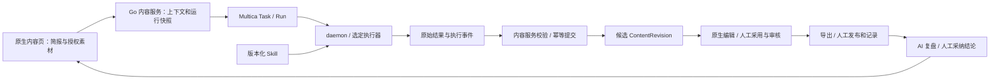

# Multica 二次开发决策与模块映射

版本：v0.6.0  
日期：2026-09-12  
决策 ID：D-10（延续 [04 决策登记](04-验收标准与追踪矩阵.md)）  
状态：已接受，实施与应用验收待执行。  
关联：[README](../README.md) · [PRD](02-开发需求PRD.md) · [技术设计](03-技术设计与开发路线.md) · [源码研究](08-Multica源码研究与小改可行性.md)

## 1. 背景与决定

用户在研究 Multica 后询问是否必须以插件添加全部需求，随后确认“复用 Multica 底座＋新增内容业务模块＋Skill 驱动 AI＋可选插件”，并要求更新相关文档。

本项目采用 Multica 二次开发，直接扩展其 Web 页面、Go 业务服务和 PostgreSQL 数据模型，复用空间、身份、项目、任务、daemon 与已支持的 Agent 后端。内容业务不是一套插件包，也不是只更名 Issue；正式作品、版本、审核和经营数据拥有独立对象与原生页面。

该决定取代 [06 Easel/Hermes 开发映射](06-Hermes开发基准与改造映射.md)中的 FastAPI/Vite 工程路线、目录和命令。Easel 保留产品参考价值，Hermes 保留为可选执行器。[07 隔离和通用执行契约](07-隔离工作空间与可替换AI执行架构.md)继续约束实施。

产品范围不变：仅中国社交媒体、个人优先、小团队预留；人审、人工发布、人工登记真实发布/指标/反馈，AI 复盘并提出下一轮建议；采用后的结论才进入长期记忆。OpenClaw 在实际交付工程中完全移除，无强制 Hermes 依赖。

## 2. 研究基准与当前状态

| 项目 | 当前证据或决定 |
|---|---|
| 上游 | [multica-ai/multica](https://github.com/multica-ai/multica) |
| 研究提交 | `3551e72e76d2c276e550b668303646d1280fb1e2` |
| 本地源码 | [research/multica](../research/multica)，保持原样 |
| 实施位置 | 拟用 app/，尚未创建；不得把研究目录写成已改造工程 |
| 工程 | Next.js / React / TypeScript，Go / Chi，PostgreSQL / sqlc，pnpm / Turborepo |
| 已完成 | 下载、定点静态研究、文档路线更新 |
| 未完成 | 依赖安装、部署、内容模块开发、Agent 联调、权限与隔离验收 |

依赖和脚本以该提交 [package.json](../research/multica/package.json)、[server/go.mod](../research/multica/server/go.mod)和 [CLAUDE.md](../research/multica/CLAUDE.md)为证据。后续实施若升级上游，必须记录新提交和差异，不默认为本报告已覆盖。

## 3. 四种实现方式

| 方式 | 本项目职责 | 边界 |
|---|---|---|
| 复用基础平台 | Workspace/Membership、Project、Issue/Task、运行记录、设备/daemon、已有 Agent Backend | 复用源码后仍需回归；不能把任务完成等同内容审核或正式作品落库 |
| 新增业务模块 | IP、来源快照、知识卡、选题、Work/Artifact/Revision、审核交接、Publication/Observation、Retrospective/Learning | 专用表、Go 事务/API 和原生页面是事实源，服务端管理所有关键状态 |
| Skill | 选题理由、对标研究、资料整理、核查、正文/渠道稿和复盘的方法及输出格式 | 不充当数据库、编辑器、任务调度器或权限门禁；运行保存版本/哈希 |
| 可选插件 | 素材侧栏、IP 摘要、审核辅助面板和以后选择的独立扩展 | 不承载唯一正式数据；未启用、关闭或卸载不能阻断核心闭环 |

例如“小红书创作 Skill”指导选题角度、证据使用和稿件格式；作品模块负责保存候选版本、显示修改差异、采用和审核；渠道交接模块导出已审核内容，由人手动发布。Skill 输出的“已通过审核”文字没有审批效力。

## 4. 模块与工程映射

下面是实施责任映射。既有目录可核对；具体 content 文件、表和接口均待新增，名称可按实施约定细化。

| 模块与需求 | 复用 | 新增/改造 | 主要实施位置 |
|---|---|---|---|
| workspace-core；R-001～004 | 工作区、成员、存储、认证和运行身份 | 内容对象空间约束、审计关联、demo 隔离 | server/internal/handler、service；packages/core |
| ip-profile；R-005～008 | 项目资源、Skill 绑定 | 账号人设提示词与表达配置、提炼候选与采用 | server 业务表/服务；core/content、views/content |
| source-inbox、knowledge-base；R-009～019 | 附件与项目材料入口 | 来源快照、解析去重、知识卡/证据、中文检索与素材包 | server 业务后台任务/查询；原生素材页 |
| topic-planning；R-020～024 | 任务/项目与 Agent 运行 | 有依据的推荐、人工决策、简报版本与今日页 | service；core/content、views/content |
| agent-workflow；R-025～030 | Task/Run、daemon、Backend | Context Pack、Skill 快照、内容产物 schema、幂等入库、隔离改造及缺失执行器 | server/internal/daemon、service；server/pkg/agent |
| work-editor；R-031～037 | 编辑组件、附件、任务关联 | Work/Artifact/WorkingCopy/Revision、渠道版本与制作包 | server 表/API；原生编辑器页面 |
| review-delivery；R-038～043 | 成员身份、状态/提醒基础 | 交付快照、人审事务、导出、排期与人工发布登记 | service；审核/日历/登记页 |
| feedback-learning；R-044～048 | Agent 任务与评论展示基础 | 人工观测、指标口径、AI 复盘版本、结论采纳和撤回 | 内容表/服务；数据与复盘页面；复盘 Skill |
| project-collab；R-049～051 | Project、成员、Issue/Task | 作品项目视图、业务日历与后续角色协作验收 | core/views；领域权限服务 |
| agent-gateway；R-052～055 | 现有身份、令牌和接口基础 | 内容 scopes、服务 API、Skill/stdio 桥接及后续 HTTP MCP | handler/service；桥接入口待实施时确定 |

SQL 位于 server/pkg/db/queries，迁移位于 server/migrations；新增表遵守上游不加数据库外键的要求，由应用事务处理同空间关联和清理。表/索引变更后按 sqlc 流程更新生成代码。服务器数据由含 workspace 的 React Query 管理，Zustand 只保存视图状态。

## 5. 任务如何成为正式作品

Work 关联上游 Project 和可选 Issue，并可有多次运行；任务与作品状态独立。业务 AgentRun/RunStep 绑定上游实际运行 ID、attempt、步骤和结果，不建立第二套 Agent 调度队列。解析/导出等后台业务任务与 Agent 执行区分处理。

提交必须验证工作区、对象访问权、schema、来源引用、基础版本、运行尝试和幂等键。重复事件不重复创建版本；取消或切换后的迟到结果留在原运行候选区。格式不合法时保留原始输出和错误，不把聊天文本自动变为正式采用稿。用户的编辑与采用指针只有领域服务能更新。

## 6. Skill 与可选插件的具体约束

首版 Skill 组按选题、研究/对标、事实核查、正文/渠道稿、AI 复盘组织，随实际任务裁剪；模板和提示词不是新功能验收证据。每次执行固定 Skill ID、版本或文件哈希、输入快照与输出 schema。更新 Skill 不改变已运行任务的历史依据。

插件入口在当前提交受 plugins_v1 控制，[设置页](../research/multica/packages/views/settings/components/settings-page.tsx:69)和 [后端开关](../research/multica/server/internal/featureflags/keys.go:57)均以 false 为回退值；后端注释说明仍在内部试用。首版不以开启此开关为安装前置条件，不把 SDK 文档中的入口当作用户已可见功能。

若后续开发插件，只通过受限内容 API 访问专用业务对象，不复制业务状态机。宿主插件调用可以使用用户会话，因此“是用户 token”不足以证明人工操作；审核、登记真实数据和采纳长期记忆须识别调用来源并经原生明确确认。插件最多提出候选内容或待确认请求，不能直接写入人工事实。插件存储适合设置与辅助状态，不是知识库、正文版本或指标的唯一存储。

## 7. 取舍与未解决差距

全部使用插件能减少部分导航改动，但仍需开发业务数据、权限和编辑能力，并受当前开关/桥接限制；只用任务模板和 Skill 适合验证过程，无法满足不可变作品版本与人工事实记录。继续旧 Python 工程再重写 Multica 调度增加维护面。因此首版直接扩展原生 Web/Go 模块，保持与上游基础层的清晰边界。

以下差距仍需实现，不因选定底座而消失：

- 上游 Codex 任务环境存在认证文件链接及 Windows 复制回退，默认执行权限也不满足本项目强隔离目标。T-01 必须改造并实测；不能复制登录凭据或静默降级空间策略。
- Pi、OpenCode、Codex、Claude、Hermes 后端的存在仅是复用依据；Gemini CLI 和完整模型 API 工作流执行器尚需新增，全部交付路径逐项验收。
- 上游 Issue revision 是并发控制，插件包版本是发布版本；两者都不能替代 ContentRevision、ReviewSnapshot 和观测更正历史。
- 许可证与品牌限制沿用 08 的指定提交核验结论；当前文档决定不等于许可条件已满足，不改品牌、不对外部署。

## 8. 实施与验收

沿 [03 的 T-01～T-10](03-技术设计与开发路线.md)推进：先固定工程、隔离和任务映射，再交付原生作品/审核/人工记录闭环，然后补资料/IP、Skill 驱动的研究创作和 AI 复盘，最后展开增强连接器、协作与可选插件。

[04 的 D10-V01～D10-V06](04-验收标准与追踪矩阵.md)补充检查插件关闭闭环、任务与作品状态分离、Skill 快照、插件身份限制、资产独立存储和应用关系事务。现有 55 项功能、10 项非功能及六条端到端场景不缩减。本次只更新文档；研究 checkout、模型登录、发布操作和应用运行状态均未改变。

## v0.5 开发基线与追踪

本轮已将品牌空间、账号授权、账号提示词、受约束 SOP、风险处置和浏览器测试决定同步到主工作流、PRD、技术与验收。仍为开发规格，不表示应用已实现。审核细节以 [审核内核计划](10-审核内核合并与精简计划.md) 为专项契约；相同输入快照在所有入口使用相同后端规则。

已确认新建品牌空间的自动预检默认开启，提审时触发，关闭后保留手动检查。首版所有账号统一使用品牌级开关，不提供账号级覆盖；最终人工审核不可关闭。首版媒体边界已确认：文字、图文文案和视频脚本在工作台内创作；图片与视频成片在外部制作后放入已授权的本地工作/素材文件夹，由工作台登记引用，作为正式作品附件支持预览、版本绑定及人工终审，替换附件后重新审核。首版不要求内置排版、剪辑、媒体生成或成片自动审核；AI 必须区分文字已检查与媒体未检查，不能以脚本检查代替成片审核。

## v0.6 已确认开发基线

历次追问的共同规则已合并到 [11-首版开发基线与实施清单](F:/GJ/内容创作工作台/docs/11-首版开发基线与实施清单.md)，覆盖账号提示词、本地文件、资料范围与偏好、联网失败及首轮 Codex 路径。本文保留本领域细节和既有需求编号；以 11 中的最终决定替代旧追问建议。实施和应用验收仍待执行。
