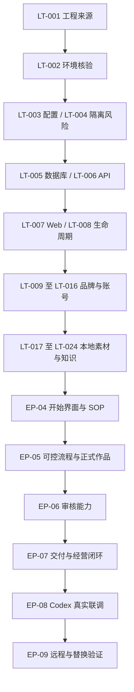

# Loretide · 首版任务实施计划

日期：2026-09-13
状态：LT-001～002、CP-01 完成；源码与工具核验已有记录，工具缺口待补齐，依赖、数据库与浏览器运行尚未验证。见 [初始化记录](../records/2026-09-13-应用工程初始化记录.md)。
任务状态来源：[功能任务 todo.md](todo.md) 与 [架构前置 architecture.md](architecture.md)，以及 [完整诊断 diagnostics.md](diagnostics.md)，三者不重复维护同一任务。本轮不创建 GitHub Issues 或独立 Codex 任务。

## 目标与依据

将 [开发基线 W-01～W-09](../docs/11-首版开发基线与实施清单.md) 转成可执行清单：近期 W-01～W-03 拆成 24 个小任务；W-04～W-09 保留 6 个阶段项，进入阶段前再细拆。不重写 PRD、不缩减既有 55 项功能需求或验收范围。

先做独立开发环境，再让浏览器实际完成品牌/账号设置和主动选择本地素材；之后实现创作、审核、经营闭环与真实 Agent。任何模拟任务都明确标记，不能作为真实模型路径通过的证据。

## 范围决定（2026-09-15，用户确认）

**第一阶段只做 web app。** 与 Windows 平台相关的部分全部搁置，不再排期：

- **不再开发**：原生 Windows 运行时与实例生命周期脚本的新功能（LT-008 已交付的 `scripts/local-windows.ps1` 保持现状，只作为跑 app 的本机环境使用，不再扩展）。
- **不再分诊**：上游 Multica 代码在 Windows 上的测试失败（2026-09-15 实测 98 条，根因为 PATH 上存在真实 `codex-cli`、Windows 路径进 JSON 被转义、创建 symlink 需 `SeCreateSymbolicLink` 特权、`HOME` 未隔离）。这些是上游代码的平台差异，不属于 Loretide 的交付面。
- **同样搁置**：上游 daemon 的 108 条执行闸门相关失败——已由 [#42](https://github.com/899ms/loretide/pull/42) 用构建约束与 `policytest.SkipIfExecutionGated` 隔离，`-overlay` 对照实验证明其中 0 条真实回归，不需要后续处理。

保留在范围内的是 `packages/`、`apps/web/`、`server/internal/content/` 这条 web app 链路，以及它的诊断验收。

## 优先级决定（2026-09-15，用户确认）：SOP 可操作优先，DG-01 拆成硬门与软门

**背景**：截至 2026-09-15，两天 60 个 PR 全部落在开发环境（LT-001～008）与诊断门禁（DIAG-01～13）上，`docs/01` §3「首次使用：建立经营底座」对应的 LT-009～016 一步未动。原因是本文件把 DG-01 写成 LT-009 的硬前置，而 DG-01 的验收面（13 张卡 + 64 条浏览器手动矩阵）长成了独立项目。

**决定**：

- **硬门**（仍然挡 LT-009 之后每一项交付，已闭合）：D13-V12 的公共接入合同——`pnpm check:diagnostics-contract` 进 CI、PR 模板检查项、`docs/development/diagnostics-onboarding-contract.md`（[#35](https://github.com/899ms/loretide/pull/35)）；以及诊断服务端不变量的自动测试（对照表 145 行中 123 行已覆盖）。**新模块不接入诊断就不能合并**，这条不放松。
- **软门**（不再挡 LT-009，随后续交付逐步补）：诊断面板自身的完整度（DIAG-06/07/09 的界面部分）、64 条浏览器手动矩阵、以及 spec 012 解锁的 19 条数据形态。这些卡**不删除、不降级为增强版**，只是不再作为开工前置；每次 LT/EP 交付时按接入合同补对应的证据。
- **立即开工**：LT-009（`specs/004-lt009-brand-workspace`，规格已备）→ LT-010 → LT-011 → LT-012 → LT-013。到 LT-013 为止，SOP §3.1「账号表达配置」在浏览器里可操作，这是第一阶段的第一个用户可见里程碑。
- 诊断线在跑的 impl 012 / spec 013 继续，优先级降为第二。
- **上游代码规则（2026-09-15，用户确认）**：「不碰上游 Multica 代码」不是绝对约束。默认不碰；SOP 需求确实需要时可以改，但要**提出来**——最小侵入、独立 `upstream:` 提交、PR 正文单列「上游改动」（为什么非改不可、替代方案、回滚、逐字节不变的自证）；风格/现代化/顺手修永远不是理由。细则见 app `docs/development/spec-kit-workflow.md` 第 13 步。
- **§3.1 完整字段与 EP-04 解绑（2026-09-15，用户确认）**：(1) 先做 SOP §3.1 的完整账号表达档案（受众、常见问题、经验与可信依据、定位、内容支柱、表达风格、禁用表达、渠道、投入时间、内容目标、文本风格样本；确认成版本；待补充标记；最小可开始条件），「Agent 提炼候选档案」因执行器禁用（原则 IX）留位给 EP-08，不伪造。(2) **EP-04 起不再等 W-03**：以粘贴文本与 URL 为输入即可开工；EP-04 先拆为「手工选题卡与冻结简报」「开始界面与输入快照」「候选选题自动生成（等 EP-08）」等独立卡，凡依赖本地文件/素材包/知识卡的半边留空位，W-03 解禁后接上。计划图里 G→H 的依赖据此改为「W-03 中与文件无关的部分不再阻塞 EP-04」。
- **W-03 决定（2026-09-15，用户确认）**：W-03「本地素材与知识」（LT-017～024）**整段等 Windows 解禁**，不按「粘贴文本先行」拆分。LT-017 的本机文件选择通道属搁置的 Windows 范围，其后各卡依赖它。W-02 收口（LT-016）后，云端会话转向 web 范围内的其它工作（诊断软门的界面项、手动矩阵解锁项），不动 W-03。
- **UI 规则（2026-09-15，用户确认）**：SOP 可操作阶段**不在 UI/UX 美观上花时间**。界面一律**整套继承上游 Multica 的设计系统与设计 token**（`packages/ui` 组件、`--text-*` 字号、语义色 token、间距与圆角），只做「把功能挂到既有组件上」，不新增控件、不调样式、不引入第二套视觉语言。原则 VII「UI reuses Multica」在本阶段的执行口径就是这一条；美观打磨留到 SOP 跑通之后再立单独任务。

`docs/13` §9「不能删除其中任何能力再将其标为增强版」仍然成立：本决定不删任何 DIAG 卡，只改变它们与 LT-009 的先后关系。

## ⏸ 开发暂停（2026-09-15 晚，用户指示「暂停全部开发」）

所有云端会话已停止。暂停时的状态：W-02（LT-009～016）八卡已合入 app-main 待用户验收；specs/021（§3.1 完整档案）与 specs/022（EP-04 拆分与 EP-04a 规格）进行中、未合入，分支保留在远端。恢复开发时从这两条分支续派。本机实例与验收 runbook 不受影响。

## 当前证据与目录约定

文档仓库为 899ms/loretide，实际工作目录 F:/GJ/内容创作工作台。研究 checkout 固定为 Multica `3551e72e76d2c276e550b668303646d1280fb1e2`，本轮只读。

已检查的上游路径：

| 实际路径（相对 research/multica） | 本轮确认的用途 |
|---|---|
| package.json、apps/web/package.json | Node >=22，pnpm 10.28.2；dev:web、Web build/typecheck/lint/test 脚本存在 |
| Makefile | 位于仓库根，依赖 shell/Compose；不是已经验证可在 Windows 直接运行的启动入口 |
| server/go.mod | Go 1.26.6 |
| server/sqlc.yaml | 查询在 pkg/db/queries，迁移在 migrations，生成代码在 pkg/db/generated |
| server/internal/handler、service、daemon | 既有服务与执行体系 |
| server/pkg/agent/codex.go、claude.go | 既有执行器实现入口，能力仍需实际验证 |
| packages/core、packages/views、apps/web | 状态/客户端、共享视图和 Web 宿主；新增 content 子目录是拟议位置 |
| CLAUDE.md | 不新增数据库外键/级联；索引需独立文件中的 CONCURRENTLY 语句，应用事务维护关系 |

拟建应用目录使用 `app/` 表示，尚不存在且由文档仓库忽略；正式路径与 remote 在 LT-001 核对并登记。不能在 research checkout 实施，更不能自动覆盖现有 899ms/multica。所有卡片中的新文件仅为模块位置建议，实施时定位实际文件后更新任务记录。

## 顺序与检查点

图为阶段主路径，精确依赖以 todo 中卡片为准。CP-01～CP-09 每 2～3 项检查一次；同一检查点内未完成的上游依赖不能越过。检查点是验证汇总，不在应用正常使用流程中添加确认弹窗，也不自动授权新部署。

可以并行的是独立的只读核验、已固定合同上的不同页面或纯测试资料编写。数据库迁移、共享路由、公共类型、同一文件和 Git 提交串行处理；目前不安排或启动多代理。

## 每项的完成标准

1. 按任务限定范围交付一条可验证行为，通常预计改动 1～5 个手写文件；若超过或跨越两个独立子系统，先拆子任务并保留父 ID，不靠增加隐藏范围完成。
2. 实际变更、需求关联、运行命令/退出码、结果和缺口写入应用工程的任务验证记录；文档仓库 todo 更新应用提交 ID 或明确的阻塞原因。不把生成代码数量误作功能范围。
3. 页面任务有浏览器证据，权限/并发/数据任务有针对性自动检查。已有上游测试通过不能替代新功能验收。修正发现的失败后才勾选任务。
4. 小任务在已授权应用仓库内形成独立提交；不自动推送别的仓库、部署远程服务或创建额外任务。

建议状态：TODO / IN_PROGRESS / BLOCKED / DONE；checkbox 仅 DONE 勾选。每个阻塞要写证据、下一动作及所需外部条件。文档任务规划完成不改变任何应用任务状态。

## 验证命令边界

静态核验确认脚本存在，但没有安装依赖或运行它们。LT-002 固定实际工具版本，LT-005～008 将实际可运行命令写入应用开发说明。

- Web 候选命令：在 app 根执行 `pnpm --filter @multica/web typecheck`、`pnpm --filter @multica/web test`、`pnpm --filter @multica/web build`；涉及共享包时补对应包检查。实际构建依赖由 LT-007 核验。
- Go：在 app/server 按本任务实际包执行 `go test <受影响包>`；应用里补精确路径，不能把占位符作为已执行命令。
- sqlc 与迁移：使用已核验配置和独立测试数据库，记录生成/迁移/恢复步骤；不对日常数据库运行测试或重置。
- 不照搬上游 `clean`、db-drop、db-reset 等破坏性命令，不读取或展示客户端令牌。
- 真正调用 Codex 与搜索属于 EP-08；LT-004 只确认接口和风险，不默认消耗额度。

## 风险与安排

| 风险 | 处理方式 |
|---|---|
| 本地 CLI 已登录不代表受限 daemon 可用 | LT-004 提前只读核验，未满足安全隔离时禁用真实执行；EP-08 修复并验证后启用 |
| 浏览器拿不到原始路径，或引入任意磁盘读取 | LT-017 先证明本机受控文件选择，交付文件引用 ID；不能为了方便改为全盘扫描或云端上传 |
| 账号提示词被实现为独立人设库 | LT-011～013 只做账号字段、配置版本及沿用；D11-V02 测试锁住边界 |
| 私有素材在搜索/缓存/日志泄漏 | LT-016、018、023 在正文读取和模型输入前过滤，跨账号负例必须覆盖 |
| 外部文件覆盖后审批误复用 | LT-020/021 保留哈希与缺失状态，EP-06/07 在审批及交付重新核验 |
| 内容模块依赖插件入口或 Electron | LT-007、013、024 用浏览器和禁用插件的路径检查 |
| 固定版本规则不等于准确 | EP-06 保留原报告、规则来源与至少30个差异样例，语义误报/漏报单独评估 |

## 进入下一阶段的条件

W-01～03 完成后应能在浏览器建立品牌和账号、设置提示词和范围偏好、主动登记素材、预览和查找授权知识。它仍不是完整内容创作产品。届时基于实际数据对象细拆 EP-04/05，不能直接把阶段项勾为完成。

首个可开始的任务是 **LT-001**。用户本次授权的是任务拆解；应用代码、环境安装、数据库启动、真实模型联调均尚未执行。

## 模块化约束补充

采用 [模块边界与变更回归约束](../docs/12-模块边界与变更回归约束.md)。ARCH-01/02 在环境准备期间落实模块依赖清单与自动检查，LT-009 依赖 ARCH-02；其余依赖不变。功能变更须检查公开接口消费者，公共权限或迁移变化扩大回归范围。此约束为待实施，不宣称已具备自动保护。

## 初期完整诊断

用户要求全量加入初期开发，不做最小版。新增13项DIAG任务和DG-01出口，见 [诊断清单](diagnostics.md)。依赖现有环境及ARCH接口先完成公共诊断/模拟能力，DG-01成为LT-009前置；真实业务组件交付时同步接入并按D13验收，不能拖到最后。诊断模块只经事件/接口观察业务，不引入业务对诊断页面的反向依赖。

## 品牌运营扩展

正式新增范围 R-056～058、R-060～061 与待办 R-059，见 [品牌运营任务](brand-operations.md)。实施前按模块细拆，原基础任务与诊断前置条件不变。

新增正式范围 R-060～061：平台搜索优化、成本/线索/成交与 ROI 复盘；任务 BO-05/06 见 [品牌运营任务](brand-operations.md)，实施前细拆。
